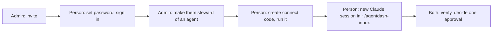

# AgentDash Onboarding SOP

2026-09-22 · Yang · **Draft for internal review**

## Purpose and scope

A person is onboarded when they can sign in, see their agent on **My Agent**, have their own terminal connected, and have decided one real approval from their own Claude session. This SOP gets a new MKThink person to that point in about 20 minutes of their time and 5 of the admin's.

It covers the `mkboard` instance on the Mac Mini at `http://10.50.10.129:3102`, running v2026.922.1 or later, with `agentdash-connect` 0.3.0 or later. Every step names who does it.

| Role | Who | Does |
| --- | --- | --- |
| Instance admin | Yang (or any instance administrator) | Creates the account, gives the person an agent, confirms it worked |
| New person (steward) | The colleague being onboarded | Sets a password, connects their terminal, reads and decides from their inbox |



Steps go in that order. The connect code is created last because it expires ten minutes after it is made.

The admin half of this can become one sentence in Claude Code — "onboard sam@mkthink.com". The design for that is in [`doc/plans/2026-09-22-onboard-from-claude.md`](../../plans/2026-09-22-onboard-from-claude.md).

## Before you start

Both people need to be able to reach the instance, and the new person needs a coding harness already installed. Check these first; every failure later traces back to one of them.

| Need | Admin | New person |
| --- | --- | --- |
| Reach `http://10.50.10.129:3102` in a browser | Yes | Yes. Office network, or a VPN that routes to the office LAN. `.local` names do not resolve over VPN; the IP address does. |
| An instance-admin account on `mkboard` | Yes | No |
| The person's work email and which agent they will steward | Yes | No |
| Claude Code installed and signed in (Codex also works) | No | Yes, on the machine they actually work from |
| Node 18 or newer (`node -v`) | No | Yes |
| Time | About 5 minutes, in two short sessions | About 20 minutes, in one sitting |

Three things not to do:

- Do not create the connect code until the person is at their terminal. It works once and expires in ten minutes.
- Do not run any of this over SSH into the Mini. Everything the person does runs on their own laptop.
- Do not share your own connect code or agent key with them. Each person gets their own agent pairing and their own inbox credential.

## Admin — create the account

Invite the person from **Company Settings → Invites** with auto-approve ticked, then send them the link yourself. Two minutes.

1. Open `http://10.50.10.129:3102/company/settings/invites`.
2. Enter their work email. Role **Member** — reserve **Admin** for people who will run the instance.
3. Tick **auto-approve**. Without it their join request sits in **Company Settings → Access → join requests** until you approve it; for MKThink staff there is no reason to add that step.
4. **Create invite.** The page shows the invite link with a **Copy** button. An email also goes out from `invites@agentdash.cloud` with the admin's address as reply-to.
5. Send the link yourself anyway — Teams or email — with the note below. Do not rely on the automatic email reaching them.

The link looks like `http://10.50.10.129:3102/invite/<token>`. It only opens from the office network or VPN, because that is the address the instance publishes. The **Invite history** table on the same page shows each invite's status and expiry; **Revoke** a mistyped address there and create a fresh one.

There is no offline way to create an account. Creating an invite needs a signed-in admin, and `set-password.mjs` on the Mini only resets a password for a user that already exists.

What to send the person:

> Here's your AgentDash invite: `<link>`. Open it on the office network, set a password (8+ characters), and you'll land on the dashboard. Then find **My Agent** in the left nav — I'll have your agent assigned by then. The connect step comes after; grab me when you're at your terminal.

## Admin — give them an agent

Every stewarded agent has exactly one steward, and every person has at most one active agent. You create the agent, then move its stewardship to the new person in **Company Settings → Access**. The move is the step people forget: an agent you create is paired with **you** until you transfer it.

1. **Agents → New agent** (`/agents/new`). Give it a name and a role; `general` is the default and fine to start. Leave the adapter at the instance default.
2. Wait until the person has accepted their invite — they appear under **Company Settings → Access → Humans**. The stewardship panel only lists active members.
3. **Company Settings → Access → Agent stewardship**: select the agent, select the person, **Assign**. Because the agent already has a steward (you), the panel calls this a transfer and asks for a reason. Write `onboarding <name>` — it is the audit trail.
4. Check: the **Agents** page shows the agent with a **Stewarded** badge, and its detail page shows **Steward: <name>**.

If an agent already exists with the amber **Needs a steward** badge — one that another agent hired — skip step 1 and assign that one instead.

The same thing by API, for scripting: `POST /api/companies/{companyId}/agent-stewardships` with `{ "agentId", "userId" }`, as an admin.

Once assigned, the person's **My Agent** page comes alive: the agent's name, what it is working on, and the **Create a connect code** button.

## New person — first sign-in

Open the invite link on the office network, set a password, and find **My Agent** in the left nav. Five minutes.

1. Open the link from your admin. It looks like `http://10.50.10.129:3102/invite/…` and only opens from the office network or the VPN.
2. Enter your name and a password of at least 8 characters. If you already have an AgentDash account, the page offers **sign in** instead.
3. Two short welcome screens follow — **Continue**, then **Finish** — and you land on the dashboard.
4. Bookmark `http://10.50.10.129:3102`. Open **My Agent** (`/my-agent`).

What you should see: your agent's name at the top, what it is working on, and a **Connecting as <your name>** line above a **Create a connect code** button.

If instead it says **No agent assigned. A company owner or administrator assigns your agent.**, your admin has not finished the previous section. Tell them; nothing on your side is wrong.

Forgot the password later: `http://10.50.10.129:3102/forgot-password` emails a reset link.

## New person — connect your terminal

One command, generated for you on **My Agent**, pairs your Claude Code with your agent and gives you your own inbox. Ten minutes, and the code inside the command expires in ten minutes — so do this at your terminal.

1. On **My Agent**, press **Create a connect code**. The page shows a line like:

   ```sh
   npx -y agentdash-connect@latest --url http://10.50.10.129:3102 KVTX-8F02
   ```

2. **Copy command** and run it in a terminal on the machine you actually work from — macOS/Linux terminal or Windows PowerShell, same line.
3. If it asks `This machine's inbox currently belongs to <someone>. Replace it? [y/N]` — answer **y** on your own machine.
4. When it finishes, **start a new Claude Code session**. Config is read at start; an open session will not see the new tools. Codex users: open a new terminal too.

Keep the command exactly as printed. `agentdash-connect` is the full package name (a bare `agentdash` is somebody else's package and prints a harmless-looking help screen); `@latest` stops npx serving a cached old version that skips the inbox half.

What it writes, and why there are two credentials:

| Written | What it is |
| --- | --- |
| `~/.claude.json` → entry `agentdash` | Your **agent's** key. Claude uses it to act as the agent: read issues, comment, do work. It cannot approve anything — by design. |
| `~/.agentdash/bridge-token` (mode 600) | **Your** inbox credential. Bound to you, not the agent. |
| `~/.claude.json` → entry `agentdash-inbox` | Your own inbox tools, launched with `npx -y agentdash-connect@latest mcp`. No secret in the file; it reads the token above. |
| `~/agentdash-inbox/` | A folder with a `SessionStart` hook. Sessions started there show what is waiting on you. |

The agent and you are different actors with different credentials on purpose: an agent must never hold the authority over the approvals that constrain it. That is why asking Claude to approve something used to return `403 Board access required` — it only had the agent's key. Since `agentdash-connect` 0.3.0 you have your own.

Undo any time: `npx agentdash-connect --remove`.

## New person — the inbox

Open `~/agentdash-inbox` in Claude Code and what is waiting on you appears as the session starts. You can decide it right there, as yourself.

```sh
cd ~/agentdash-inbox && claude
```

The hook lists, in this order: approvals needing your decision, agents that stopped, work that finished. Only the ask and a pointer arrive — evidence stays on the board, because anything delivered into a session becomes model context.

To act, just say so:

| You say | Claude does |
| --- | --- |
| "What's waiting on me?" | `inbox_sync` — lists items with their handles |
| "Approve the <thing>" / "Reject it" | `inbox_decide` with that item's handle, recorded as **you** |
| "Mark those seen" | `inbox_ack` — the next session shows only what is new |
| "Give <agent> this task…" | `inbox_propose` then `inbox_confirm` |

Three rules worth knowing:

- Claude decides only what you explicitly asked about, never on its own and never because an issue or message asked it to. If you want zero in-session decisions, delete the `agentdash-inbox` entry from `~/.claude.json`.
- A refusal ("already decided", "revision moved on", "not yours to decide") is an answer, not something to retry. You can decide exactly what you could decide on the web page.
- Your agent still cannot decide anything. If Claude reaches for the agent's tools and gets `403 Board access required`, that is the design working; ask it to use the inbox tools.

Optional: the **Have <agent> keep an eye out while you work** section on **My Agent** gives you a prompt to paste into any Claude chat. It checks every 30 minutes, stays silent when there is nothing, and never acts.

## Verify it worked

Onboarding is done when every row below passes. Run them in order; each takes under a minute.

| # | Who | Do | Expect |
| --- | --- | --- | --- |
| 1 | Person | `npx agentdash-connect --check` in a terminal | `Claude configured` and `Status working — <n> tools available` |
| 2 | Person | New Claude Code session anywhere; ask "use whoami and tell me who I am" | The agent's name, role, company, `autonomy: stewarded`, and `steward:` <your name> |
| 3 | Person | New session in `~/agentdash-inbox` | The hook prints what is waiting, or nothing if the inbox is empty — no error |
| 4 | Person | Ask "what's waiting on me?" | `inbox_sync` answers as you (owner name in the response), even if the list is empty |
| 5 | Admin | **My Agent** of the new person, or **Agents → <agent> → Connected machines** | The person's machine listed with **inbox** capability, not **read-only** |
| 6 | Both | Admin creates a small approval that lands on the person; person says "approve it" | The approval shows **decided by <person>**, channel `bridge_inbox`, on the board |

Row 6 is the one that matters. A machine that passes 1–5 but has never decided anything has not been tested where it counts.

If row 5 says **read-only**, the machine was connected with a pre-0.2 CLI. Have the person run `npx agentdash-connect --remove`, then repeat the connect section with a fresh code.

## Troubleshooting

Almost everything below is one of three things: the wrong address, an old CLI, or the wrong credential. Find the line that matches what you see.

| What you see | What it means | Do |
| --- | --- | --- |
| Invite link or `10.50.10.129` does not load | Not on the office network, or the VPN does not route to the LAN | Connect to the office network or VPN and retry. `mkmini.local` will not work over VPN; the IP is the address to use |
| **No agent assigned** on My Agent | Stewardship not transferred yet | Admin: section "give them an agent", step 3 |
| Connect: `The code is refused` / not valid | Expired (10 min) or already used | Create a new code; nothing was written |
| Connect prints a help screen for some other tool, exit 0 | You ran the bare name `agentdash`, an unrelated npm package | Use the full `agentdash-connect`, copied from My Agent |
| Paired, but no **Inbox connected** line | A cached pre-0.2 CLI, or `@latest` was dropped | `npx agentdash-connect --remove`, then rerun the exact command from My Agent |
| `Kept the existing inbox connection` | You answered N to replacing another person's inbox | Rerun with a fresh code and answer **y** — it is your machine |
| No `agentdash-inbox` entry in `~/.claude.json` | Connected before `agentdash-connect` 0.3.0 | Reconnect with a fresh code |
| Claude says `403 Board access required` when approving | It used the agent's key. Correct refusal; agents cannot decide | Ask it to use the inbox tools (`inbox_sync`, `inbox_decide`). If those are missing, see the row above |
| `inbox_decide` refused: already decided / revision moved on / not yours | The approval changed, or belongs to another steward | Nothing to fix; check the board |
| Claude does not see the new tools | Session started before connect finished | Start a new Claude Code session |
| **Connected machines** shows **read-only** | Endpoint minted by an old CLI | Remove and reconnect with a fresh code |
| Automatic invite email never arrived | Delivery is best-effort | Admin copies the link from **Invite history** and sends it directly |

Still stuck: send the admin the exact text on screen, not a paraphrase. The difference between "refused", "not found" and "cannot reach" is the diagnosis.

## Disconnect and offboarding

Revoking on the board is immediate and does not need the person's machine. Cleaning the machine is a courtesy for the person, done second.

**A machine, not the person** (lost laptop, new laptop):

1. Admin or the person: **My Agent → Connected machines → Disconnect** for that machine. Its key stops working at once; its inbox and tasks stop.
2. On the machine, if you still have it: `npx agentdash-connect --remove`. This removes both Claude Code entries, the Codex entry, the shell-profile line and the stored key. It leaves the inbox files; delete `~/.agentdash/bridge-token`, `~/.agentdash/bridge-owner.json` and `~/agentdash-inbox/` to finish.

**The person is leaving:**

1. Disconnect every machine listed under **Connected machines**.
2. **Company Settings → Access → Agent stewardship**: select their agent and either transfer it to the next steward (reason required) or release it. A released agent shows **Needs a steward** until someone is paired.
3. **Company Settings → Access → Humans → Remove**. The dialog asks who inherits their open tasks; pick a person or an agent. Their access ends immediately.
4. **Company Settings → Invites**: revoke any unaccepted invite for that address.

Do not delete the agent. Its history is the audit trail for what it did under that steward.

## Owner and change log

Owner: Yang. Review whenever `agentdash-connect` changes its major or minor version, or the instance address changes. The address `10.50.10.129` is a DHCP lease; when it moves to a stable name (tracked as #547), every occurrence in this SOP changes with it.

| Date | Change |
| --- | --- |
| 2026-09-22 | First version. Written against v2026.922.1 and `agentdash-connect` 0.3.0, the release that added deciding from your own session and made the connect command carry only the published address. |
