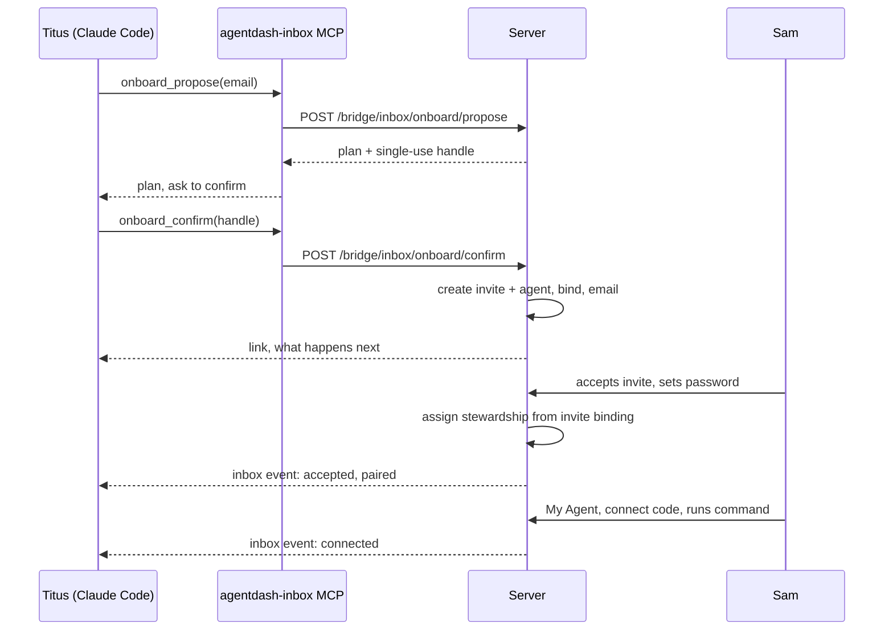

# Design — "onboard sam@mkthink.com" from Claude

2026-09-22 · Yang · **Draft for internal review** · Companion to [`doc/customers/mkthink/08-onboarding-sop.md`](../customers/mkthink/08-onboarding-sop.md)

A steward types one sentence in their own Claude Code and the account, the agent and the pairing are set up with **their** authority, in two turns: Claude shows the plan, the person says yes. This automates the admin half of the onboarding SOP. The new person's half — open the link, set a password, run the connect command — cannot be removed and is shortened instead.

## What the steward experiences

> **Titus:** onboard sam@mkthink.com
>
> **Claude:** Here is what I will do, as you:
>
> - Invite **sam@mkthink.com** to MKThink as **Member**, auto-approved. Expires on the date the server sets.
> - Create a stewarded agent **Sam's Chief of Staff** (role `chief_of_staff`, instance default adapter), unpaired.
> - Bind the invite to that agent, so Sam becomes its steward the moment they accept.
>
> Nothing has happened yet. Go ahead?
>
> **Titus:** yes
>
> **Claude:** Done. The invite email is on its way; here is the link to paste into Teams as well: `http://10.50.10.129:3102/invite/…`. I will tell you when Sam accepts and when their machine connects.

Later, in Titus's inbox: *Sam accepted and is paired with Sam's Chief of Staff — not yet connected.* Then: *Sam's laptop connected, inbox-capable.*

## The flow

Every arrow into the server carries Titus's **inbox token**, never the agent's key. The server re-checks Titus's permissions in the target company on both calls.

## Why it lives in the person's inbox tools, not the agent's

Inviting a human and pairing an agent are board-user actions. Today the invite route (`POST /invites` in `routes/onboarding-v2.ts`) demands a signed-in board user and the stewardship route gates on `agents:create`; the agent's MCP key gets `403 Board access required` on both, and that is correct — an agent must not create the people who govern it. The inbox token is bound to a person (`bridge_endpoints.user_id`), and `inbox_decide` already acts with that person's authority through a single-use handle re-checked at redemption (`services/steward-inbox.ts`). `onboard` is the same shape: same credential, same handle discipline, same rule in the tool description — only when the person explicitly asked, never on the model's initiative. This is #662 extended from deciding to onboarding.

## Server changes

| Change | Where | Notes |
| --- | --- | --- |
| `POST /bridge/inbox/onboard/propose` and `/confirm` | `server/src/routes/bridge.ts` | Same `requireEndpoint` + handle pattern as `propose`/`confirm`. Handle: single use, one hour like decision handles, bound to the endpoint and to a hash of the plan |
| Authority check | steward-inbox service | `endpoint.userId` must hold `users:invite` **and** `agents:create` in the endpoint's own company (`bridge_endpoints.company_id`). Refusal is an outcome, reported in the person's words |
| Invite creation as a service | extract from `routes/onboarding-v2.ts` (`POST /invites`) | Route is bound to `req.actor` today. Service takes `invitedByUserId`; `autoApprove` default true; `defaultsPayload.onboarding = { stewardAgentId, membershipRole }` |
| Agent creation | agents service | Stewarded and **unpaired** ("Needs a steward") — deliberately not paired to the creator, which is what board-created agents do today and the step people forget |
| Accept hook | `routes/access.ts` accept handler | After membership is active: if `defaultsPayload.onboarding.stewardAgentId` is set, assign stewardship to the new user, reason `onboarded by <inviter> via inbox`. On failure leave unpaired and notify the inviter |
| Landing | invite accept redirect | With a bound agent, land on `/my-agent` instead of the two welcome screens |
| Events to the inviter's inbox | steward-inbox events | `invite_sent`, `invite_accepted_paired`, `machine_connected`. Connect-code redeem already knows the steward |
| `POST /bridge/inbox/onboard/status` | `bridge.ts` | One call returning invite state, membership, agent, stewardship, connected machines for an email |

## Client changes (`agentdash-connect` 0.4.0)

Three tools added to `packages/connect/src/inbox-mcp.mjs`, next to the six that exist:

| Tool | Input | Does |
| --- | --- | --- |
| `onboard_propose` | `email`, optional `agentName`, `role`, `membershipRole` | Returns the plan in plain words and a handle. Nothing happens |
| `onboard_confirm` | `handle` | Spends the handle; returns the invite link and the paste-ready note |
| `onboard_status` | `email` | Where a person is in the flow, for "did Sam ever finish?" |

Server instructions for the model: propose only when the person named a specific email to onboard; always show the plan and wait; never invent or guess an address; a refusal is an answer.

Machines connected before 0.4.0 get the tools on their next reconnect, as with 0.3.0.

## Defaults and guardrails

| Decision | Default | Override |
| --- | --- | --- |
| Membership role | Member | "as admin" — proposed **not** allowed from the terminal; admins are made on the web |
| Email domain | Must match the inviter's own domain | "external" stated explicitly. `companies.email_domain` does not gate joining today, so this is the only guard |
| Agent name and role | `<First name>'s Chief of Staff`, `chief_of_staff`, instance default adapter | Any of the three, named in the sentence |
| Person already a member | Skip the invite; propose the stewardship only. One active agent per person: if they have one, report it and stop | — |
| Pending invite exists | Report it; offer to resend the link or revoke and redo | — |
| Retry of `confirm` | Idempotent: returns the same link, creates nothing twice | — |
| Audit | `invites.invitedByUserId` = the steward; stewardship history carries the reason; the activity log records `onboard` with the endpoint id | — |

## What still needs Sam, and how to shorten it

Sam must open the link on the office network, set a password, and run the connect command. The connect code pairs **Sam's** machine to **Sam's** agent and mints **Sam's** inbox credential, so it has to be created by Sam's own signed-in session and it expires in ten minutes. Two things shorten this without weakening it: land Sam on **My Agent** directly after accepting, and have that first visit pre-create a connect code and show the command, so the page Sam sees is the one thing to do.

## Rollout

1. Server: routes, service extraction, accept hook, events, status — one pull request, with the accept-hook path tested against an embedded database.
2. `agentdash-connect` 0.4.0 with the three tools and updated instructions; ships in the same window, as 0.3.0 did with #662.
3. Existing stewards reconnect with a fresh code to pick up the tools.
4. First real run with a throwaway address on staging, then a real colleague.

Effort: estimated at 2–3 working days for one person, most of it the accept hook and its tests. Estimate, not a measurement.

## Open questions

- Default agent role: `chief_of_staff` like the existing MKThink agent, or ask every time? Proposed: default, overridable.
- Should a steward be able to grant **Admin** from the terminal? Proposed: no.
- Should the invite also carry the connect instructions in the email body? Proposed: yes, one paragraph, since the email already exists.
