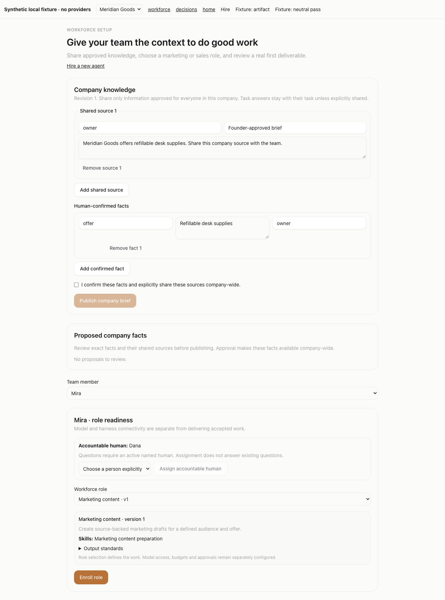
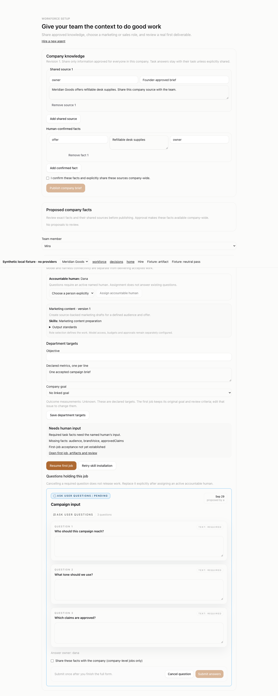

# Workforce onboarding build evidence

Date: September29,2026. Branch: `codex/workforce-onboarding-20260929`. Base: `347ffaea5aba76cf818bccc3f3f9d19e0967d980`.

Status: implementation in progress, not a launch certification. The founder authorized adding this must-have to the launch checklist and building it. See [requirements](2026-09-29-workforce-templates-requirements.md), [implementation plan](2026-09-29-workforce-onboarding-implementation.md) and [launch gates](../LAUNCH.md#required-launch-gate-workforce-templates-and-company-onboarding).

## Current implementation state

| Part | Evidence status |
| --- | --- |
| Catalog, knowledge, enrollment, skills, first-job evidence | Reviewed, targeted checks passed. |
| Named text questions, issue holds/resumption, native prompt delivery | Reviewed, targeted checks passed. |
| All hiring materializers and existing MCP transports | Reviewed, targeted checks passed. |
| Setup/hiring/readiness/inbox/review UI | Reviewed; two cache defects fixed and independently re-reviewed. |
| API/MCP/human bridge parity across page workflows | Whole-app inventory mapped; first20 transport operations committed; independent review found3 defects, fix `0fc627204` passes110 containing tests and scoped re-review; remaining page families pending. |
| Foundation current authority and direct onboarding/question source visibility | Core `4b2432633` and source-gap fix `bb306b91b` are independently reviewed; initial232/final85 overlapping tests and scoped types passed. Required inactive-owner recovery is blocked by a reproduced native stewardship-transfer deadlock; its unfinished changes are local and excluded from the draft PR. The parent gate stays closed. |
| Canonical task/comment acceptance and current authority | Reviewed with actual PostgreSQL/HTTP rollback, refusal, concurrency and unknown-outcome evidence. |
| Workspace persistence uncertainty | Writer ordering and original-run quarantine reviewed; usable human recovery remains pending. |
| Task-tree prerequisites | Named central/routine/import/workspace writers and complete tree action gate reviewed. Read-response race and duplicated payloads corrected and re-reviewed. |
| Composed workflow, full candidate checks and final review | Pending. |
| Actual intended-model quality, customer acceptance and cost | Pending launch trials. |

## Current-authority integration — bounded core reviewed

Commit `4b2432633a9e39c75a46e943bf7e9c58480a0724` adds protected current-source reads, handle preparation, native first-write guards, fresh postcommit/recovery projection, and separate filesystem/catalog/assignment/failure stages for curated skills. Global identity retains the full native user projection and zero-company cases. The original twenty operation schemas and frozen identity/input prerequisites are unchanged.

Final settled verification passed **232 tests across17 files, no skips,67.19seconds**, plus server/shared/MCP typechecks and diff checks. Root checked actual logs and all25 owned settled/current/committed hashes. SQLite warnings remain. Earlier parallel database setup skips are excluded; exact shell argument ordering for evolution logs01–13 was not retained, while final commands14–33 are recorded. This initial candidate was not approved.

Independent review found two Important source gaps: native replacement committed before denying access to its predecessor, and answer sharing omitted its consumed enrollment witness. Three actual regression failures reproduced them. Fix `bb306b91b` applies pre-effect predecessor authorization, stages the actual sharing enrollment without unrelated job/goal references, and reuses one replacement constructor. The final covering check passed **85 tests across seven files, no skips,37.01seconds**, with server typecheck/diff and unchanged source hashes. Counts overlap the initial check.

Independent scoped re-review closed both Important findings and the duplicate-constructor Minor, with no new blocking defect. The bounded core is reviewed. The separately required inactive-owner workflow, full page coverage and launch proof remain pending.

A required keyless question remains stranded after its original human owner becomes inactive. One passing test in the232 characterizes that defect; it does not demonstrate recovery. A separately scoped safe-metadata/confirmed-cancellation/canonical-replacement/genuine-answer workflow, including UI access despite private readiness, is mandatory before the parent gate passes. Full page parity, composed launch checks, full monorepo checks and actual intended-model/customer/cost trials remain pending.

Recovery implementation interim: the owner reports a disposable PostgreSQL/native HTTP flow passing from private readiness404 through safe discovery, cancellation without wake, an ID-only replacement owned by the new accountable human, a genuine answer and that human's readiness200. The native input algorithm consumes the old cancelled row as a replacement target and the new answer as sufficient input; no privacy-role change was needed. These are interim, overlapping checks. UI, registered MCP/bridge, concurrency, privacy and unknown-outcome evidence, the settled source freeze and independent review are still required before recovery is certified.

## Core backend — reviewed

Commits `87d6d8ff2` and `784fde40f` add marketing-content/sales-support version1, sourced revisioned human-approved company knowledge, immutable template enrollment with optional company goal, native skill registration, first-job creation and artifact/neutral-verdict readiness.

Independent review found three blocking issues: reviewer impersonation through the existing verdict HTTP boundary, a missing canonical issue-created event, and a concurrent configuration overwrite during skill installation. Each was reproduced with real local PostgreSQL, fixed, and independently re-reviewed with no open Important/Critical finding in this task.

Final scoped verification: **57/57 tests across seven files**, no skips, serial file scheduling; server TypeScript and diff checks exit0. Shared/DB typechecks and fresh migration0139 replay passed in the core task. One earlier parallel temporary PostgreSQL startup failed before tests; it is preserved as failed evidence, with the full successful serial run recorded separately.

These results prove scoped persistence, authorization and concurrency behavior. At this core checkpoint, hiring, UI and whole-branch validation were pending. Questions/runtime, hiring and UI are now reviewed as recorded below; whole-branch validation is still pending. Actual intended-model artifact quality, customer acceptance and cost are separate launch gates. No production/customer/live3199 changes, paid provider calls or outreach occurred.

## Questions and runtime — reviewed

Commit `a143737eb` adds text questions, authenticated named-owner answers, issue-local private answers, explicit company sharing, persisted dispatch/completion holds, first-job continuation and pending-question inbox data. It also delivers a bounded template/context layer through nine native adapter prompt paths, including resumed turns. Unsupported runners remain ordinary runners and cannot enroll in these templates.

Scoped final runs passed: 53 state/route tests across six files, 76 adapter/UI tests across six files, and 65 compatibility tests across five files. These runs overlap and are not a count of unique tests. Server, shared, UI, adapter utilities, eight packaged native adapters and the actual `@agentdash/mcp-server` typechecks passed. The native prompt capture suite covers 41 adapter cases. Earlier failures and unmatched-filter commands remain in the task report; only final successful runs count as evidence.

Independent review found a cancelled-to-done completion bypass. Fix `5afbac4ef` reproduced both enrolled and reassigned cases with real PostgreSQL and closed the bypass; 22 focused tests and server typecheck passed. Independent re-review approved the correction with no open Important/Critical finding in this task. The ordinary Home/Decisions screens still require Task4 rendering of the new inbox projection. Hiring integration, browser proof, full validation and actual intended-model/customer quality remain pending.

## Hiring integration — reviewed

Commit `022758c59` carries explicit template selection through ordinary create/hire, single proposals, initial/revised team plans and assistant-confirmed hires, including existing MCP transports. Selection is validated against the catalog, assistant confirmation uses its pinned ID/version, and installation runs after hiring transactions commit. Custom instructions and the separate runtime role layer remain present. Native adapter compatibility is shared rather than duplicated. Failed or incomplete skill installation now prevents business readiness while preserving accepted-job evidence.

Scoped verification spans 15 suites. The initial 11-suite run passed 194 tests; final changed hiring/assistant and hiring/plan subsets passed 52 and 86 respectively, and four readiness/runtime suites passed 28. Counts overlap; they are not a single aggregate run. Server, shared and MCP typechecks passed, with the actual MCP bundle rebuilt for its HTTP tests. Independent review found a missing canonical instruction bundle on newly managed single hires. Fix `02e4f9726` reuses all four default files with proposal context as a supplement; 48 focused tests and server typecheck passed. Independent re-review found no open Important/Critical issue in the task.

## Integrated UI and human APIs — reviewed

Commit `4f7a3db8e` adds standard-hosted workforce setup, company knowledge/proposal review, objectives and goal targets, hiring previews, first-job readiness/retry, Home/Decisions questions and explicit owner recovery. Human fact review and target configuration have company-scoped, revision-checked APIs. It incorporates the bounded PR821 hosted-hire changes and reviewed reopen/stale-response correction.

Exit-confirmed checks: full UI **240 files / 1,479 tests**, focused backend/live-event/recovery **four files / 45 tests**, UI typecheck/build, server typecheck and diff check. Browser proof used real components and synthetic local HTTP at4387, with nine preserved images of hiring, needs-input, answer/removal, review/ready, company switching and mobile layout. These images predate final CTA/a11y fixes; the accepted-state CTA fix has assertion red→green evidence. Chrome requested debugging permission for screenshot refresh; no retry/bypass occurred, and the fixture server was stopped. The final-pixel gap is disclosed for independent review.

The founder subsequently required all human-facing workflows through API/MCP/bridge. This task records its complete screen/action-to-HTTP table; transport parity and whole-app coverage remain separate pending implementation, with existing credentials/capabilities being mapped.

Independent review found stale owner controls and readiness updates missing from production activity invalidation. Fix `d692a5e3b` refreshes actual UUID/short-key detail queries and company-scoped workforce queries from production events. Owner red6 and readiness red28 preceded the fix; eight containing suites passed88tests, UI typecheck/diff checks passed. Independent re-review closed both Important findings with no new Important/Critical defect. Tests use mounted query consumers and the production invalidator with fake HTTP; they do not claim a real WebSocket/provider run. Earlier screenshot timing and populated-mobile gaps remain disclosed.

## Human transport foundation — reviewed

The new local `human` MCP toolset uses the existing browser-approved named-human CLI credential and a distinct typed `/api/human-control` bridge. Every operation retains canonical company/role/source checks. Explicit target selection and durable prepared confirmation records bind actions to their human, connection and target. Existing OAuth assistant and MK laptop transports retain their separate authority; the broad board credential remains capable of authorized ordinary REST and is not a confined delegated token. No live key or grant was issued.

The whole-app action inventory and [coverage ledger](2026-09-29-human-control-plane-transport-coverage.md) distinguish pending operations from tested ones. Implementation proceeds through reviewed foundation/workforce, core collaboration, company administration, self/instance and file/public/security/plugin lanes. No full-page parity is certified yet.

Commit `8185789b5` implements20 bounded workforce/question/owner operations through the named-human bridge and six registered MCP tools. It adds15-minute identity/key/target-bound hash-only confirmation handles with current authority checks, one execution attempt and durable unknown-effect recovery. It also closes explicit invalid-credential local fallback and omits private source/answer request and error bodies on affected failure-log paths. The underlying board credential is unchanged in authority.

Exit-confirmed scoped runs:23 server files/253tests;4 compatibility files/107tests;15 MCP files/208tests;15 shared files/171tests; DB/shared/server/MCP/UI typechecks. The final12-test expanded bridge run overlaps the server count. Real HTTP/DB and actual SDK tools/list+call tests exercise canonical actions, current permissions, exact-owner questions, persisted continuation and drop-after-wake recovery. Warnings and earlier corrected fixture failures are retained in the implementation report; scoped greens are not full monorepo or actual-model evidence. Source is frozen for independent spec/quality review. Hiring dialogs, all other page families, files/secrets, public continuity and full coverage remain pending.

Independent Task5a review found three Important defects: raw HTTP terminal replay could disclose a cached private result after access loss; mixed-case accepted Express paths could evade private-body/error logging classification; skill-retry unknown-effect recovery lacked a concrete enrollment reference. All three are assigned to the original implementer with focused raw HTTP/SDK and captured-logger regressions before the next page family. This lane is not approved yet.

Fix `0fc627204` removes full cached values from terminal refusals, authorizes recovery references against current resource/owner visibility, normalizes accepted route casing for privacy classification, and persists enrollment references before skill installation. All three behavioral assertion reds precede greens;10 containing files/110tests and server typecheck/diff pass. The first-job failure/recovery test now asserts exactly one persisted issue/run/wakeup. Independent scoped re-review is pending; the task is not approved until that gate clears.

Independent scoped re-review approved `0fc627204`: all three Important findings closed, no new Important/Critical regression. Task5a is complete and reviewed. The rest of whole-app transport parity and final composed/build/model launch gates remain pending.

The core issue transport preflight found canonical actions whose cancellation/reopen effects precede later guards, and tree membership resolved outside its hold transaction. Row-only compare-and-set or an outer bridge lock would not meet zero-effect stale/refusal and exact-target requirements. Two reviewed canonical prerequisites now precede descriptor registration: issue mutation/comments and compound tree actions. The initial core transport dispatch performed read-only inspection only; it made no source changes or runtime reproduction claims.

## Shared current-board identity checkpoint — reviewed

Commit `808fe07c4` shares Request-bound native identity facts and final credential lifetime checks across issue/tree authorization. Real middleware/PostgreSQL/HTTP tests reproduced original-key expiry extension and identity substitution before the fixes. The corrected final source passes **200 tests across nine suites**, server typecheck and diff check; source hashes match across the final gate and commit. Independent review approved with no Critical/Important findings. The helper preserves key/session/local access and returns facts, not action permissions. Its limited private profile does not replace the existing public identity response. Diagnostic noise is retained. Protected foundation integration, readiness-source privacy, native skill-stage checks and whole-app transport remain pending; these tests do not measure output quality.

## Original credential provenance checkpoint — reviewed

Commit `3c761c672` captures the original middleware-verified board credential privately on the actual Request, rejects later identity substitution, and preserves its original expiry even if the stored deadline is extended. Real PostgreSQL/HTTP regressions preceded the fix; the final four-suite checkpoint passes 27 tests, server typecheck and diff check. Independent review approved this checkpoint with no Critical/Important finding. The deadline-test robustness minor is closed by the subsequent reviewed source-tracking task; existing diagnostic noise is retained. This does **not** complete Task5b1a: protected current-authority reads/writes, readiness-source privacy, native skill-stage guards and broader API/MCP/bridge coverage remain open. Three real private-readiness counterexamples remain unfixed.

## Native readiness source tracking — reviewed

Commit `3532c562b` records the answer, replacement and winning-fact identities actually used by native readiness, preserving default results and private source roles. Actual PostgreSQL observer and role assertion failures preceded the fixes; the final seven-suite gate passes 85 tests, server typecheck and diff check. Independent review approved with no Critical/Important finding and closed the earlier deadline-fixture minor. Source tracking supplies the later permission collector; it adds no authorization and does not fix the retained private404 cases. Whole-app transport, composed launch proof and actual output/cost trials remain pending.

## Canonical issue acceptance prerequisite — in progress

Whole-app transport verification exposed existing ordering defects through actual authenticated HTTP and disposable PostgreSQL. Three intended RED cases show forbidden assignment403 and DoD422 still cancel the selected running run, and a worker comment rejected403 for interrupt still reopens a closed issue. The retained untracked regression is not a passing gate. No canonical repair is certified yet.

The shared repair is split into transaction-aware primitives, standalone comment composition, PATCH composition, credential witnesses and participating predicate writers. Tree topology acceptance is a separate prerequisite before issue action registration. Commit/audit acceptance does not establish external cancellation/wake delivery; unknown outcomes require diagnosis without automatic replay. API/MCP/bridge parity remains incomplete.

Primitive candidate `2b17ef5e8` passed11 focused real-PostgreSQL tests,158 containing regressions and server typecheck. Independent review then reproduced a settings/issue lock inversion returning PostgreSQL40P01, so this candidate is **not approved**. A scoped fix and concurrency regression are in progress; broader HTTP acceptance and transport gates remain pending. Disclosed baseline warnings do not count as test failures or clean-output proof.

The primitive deadlock fix `ca47c49ba` passed17 focused tests (including two distinct PostgreSQL backends with explicit barriers),138 containing regressions and final-source server typecheck/diff checks. Scoped independent re-review approved it without new breakage. The reviewed composition contract uses a root-bound issue service with a distinct explicit transaction; settings readers normalize without initialization. Root wrappers retain operation-start initialization for existing targets. This closes the primitive prerequisite only; HTTP comment/PATCH ordering and broader concurrency/transport gates remain pending.

## Standalone comment acceptance candidate

Commit `27a953752` makes accepted comment/reopen/checkout/reference/confirmation/audit writes atomic, then dispatches exact selected effects after commit. Real PostgreSQL/HTTP refusal and lost commit acknowledgement failures were reproduced before their fixes. The committed source passes24 focused tests;107 containing tests and server typecheck also pass, with disclosed diagnostics. Independent task review is in progress. This is a prerequisite to transport parity, not whole-app coverage or real-model quality proof; PATCH, current credential checks and concurrent predicate writers remain pending.

Independent review caught a false cancellation claim when canonical cancellation returns an already finished run. Fix `719863a96` reproduced succeeded/failed cases, then passed71 covering tests and server typecheck. Scoped independent re-review approved with no new breakage. Standalone comment acceptance is now reviewed; this closes that prerequisite only. It does not certify PATCH, current credential/predicate concurrency, transport coverage or real worker output.

## Issue update acceptance candidate

Commit `03264d103` composes the full issue update, optional comment and review decision, references, confirmations, routine bookkeeping and mutation audits in one transaction, then dispatches selected effects. Original rejected-assignment403 and missing-DoD422 cancellation leaks were reproduced and fixed. The settled source passes428 tests across19 suites, including35 real-PostgreSQL acceptance cases, and server typecheck. Independent task review is underway. Current authority/predicate concurrency, tree control and broader API/MCP/bridge coverage remain pending; these results do not measure real worker quality.

Independent issue-update review identified two Important gaps: whole-row snapshots became stale on unrelated activity, and canonical goal/domain resolution occurred after the private pin and checkout application. Fix `2fb8ed1e9` shares SELECT-only canonical resolution/validation before adoption, pins conditional intent facts and effective fallback goals, and applies the same resolution to actual comment reopening. Real PostgreSQL failures preceded the fix; the final source passes **21 suites / 457 tests**, including52 PATCH/shared-composer acceptance cases, and server typecheck/diff checks. Scoped independent re-review is pending. These results close neither credential/predicate concurrency nor whole-app transport or real-model quality gates.

Scoped independent re-review approved `2fb8ed1e9`: both issue-update findings are addressed, with no new blocking defect. The PATCH composition prerequisite is now reviewed; current credential/project authority, participating predicates, tree topology and all remaining transport/quality/launch gates stay pending.

## Current credential/project authority candidate

Commit `22a292f7e` adds private verified provenance, exact original-key/session/JWT/assistant-token and live loopback checks, positive SHARE witnesses, canonical human source/destination project access and company-first agent removal. Actual HTTP failures for revoked keys/private projects and PostgreSQL removal deadlocks preceded the fixes. Final amended source passes54 authority tests and4 existing cleanup tests plus server typecheck; MCP typecheck and a22-suite399-test containing run precede the final bounded FK/removal changes and are not presented as a fresh whole-source aggregate. Tests use real disposable DB/middleware/HTTP; session resolution uses a trusted fixture resolver, not a full browser login. No live3199/model/provider/customer changes occurred. Independent review found two blocking gaps: the first preparation can disclose a newly rebound private closed workspace before its binding guard, and retired CEO/CoS prompt additions must remain inert comments. A focused fix round with real-PG/HTTP race evidence and independent re-review is in progress; the authority prerequisite remains unchecked. Absent predicates, execution-workspace/topology writers, all remaining page transports and real-agent outcome quality remain pending.

Fix `1d9ab9e84` checks each freshly selected issue before preliminary policy can project workspace data and makes the retired prompt blocks inert. Both first-preparation leaks were reproduced with real PostgreSQL/HTTP before correction. The settled source passes158 tests across5 suites, server typecheck and diff check. Independent scoped re-review approved both corrections with no new blocker. This closes the issue current-authority prerequisite only; whole-app transport, participating predicates/topology, full final integration and actual worker-output quality remain unverified.

## Outer-commit publication and hiring candidate

Commit `360354b04` passes269 tests across17 files plus server/MCP typechecks and diff check. It propagates explicit transaction/event collectors, publishes after actual commits, moves hiring files outside locks, records accepted hire IDs for repair, and preserves later user pauses. Independent review approved the scoped changes with minor test-format/output followups. Controller reconciliation confirmed a skill-assignment lost-acknowledgement gap: an already committed assignment can be marked failed and invite retry. That focused fix and re-review are pending, so this prerequisite remains unchecked. Full predicate/topology, foundation authority, whole-app transport and actual model-quality gates remain open.

Fix `e1b47abcf` conservatively reports a lost assignment acknowledgement as unknown before any false installation-failure write. Real PostgreSQL and HTTP regressions preceded the fix;75 covering tests, server typecheck and diff check pass. Independent scoped review approved with no new issue. The publication/hiring prerequisite is reviewed; its minor test-format/output followups are deferred. Concurrent predicate writers, tree topology, foundation authority, whole-app API/MCP/bridge parity, final integration and real output quality remain pending.

## Predicate writer gate — September29 reviewed

Commit `ce9854b5df2bcd285ed880e6db6c85538844f21f` closes the bounded issue predicate writer gate after independent specification and code quality approval. Actual PostgreSQL and canonical HTTP exercise both concurrent orders for blockers, questions, confirmations, DoD, approved brief facts, minimal holds, goal defaults and scoped document target changes. Final settled-source verification: **30 suites /440 tests passed**, server typecheck and diff checks passed. A real prelocked transaction deadlock was reproduced and fixed with a narrow company NO KEY UPDATE mutex; positive authority SHARE witnesses remain. Early logs without exact command headers are qualified; final containing command and exit are retained.

Full tree membership/topology, workspace inverse edges, complete document action composition and whole-app API/MCP/bridge remain separate open gates. Real-model quality and full release verification are unrun. This is not launch approval. Minor test readability and expected diagnostic noise remain for final review.

## Workspace writer prerequisite (5b2p), independently reviewed

Company-first workspace/source acceptance and durable original-run uncertainty guards are committed at `f456f37528ba813fac9465c647af327a6b81dd2a`; review found adapter result metadata could mint an authoritative hold. Fix `3258f5aae0344a0140862dfbfa7d01effbf70057` reserves result fields and a server-written usage provenance stamp. Independent scoped re-review closes that finding with no new Critical/Important issues. Actual adapter-forgery RED/GREEN and stamp-only usage metering/budget preservation are retained. Final settled containing run: **27 files / 514 tests passed**, server typecheck and diff check exit0. Counts overlap previous 425/35 runs and must not be added.

This is bounded persistence/admission evidence, not usable human recovery or launch approval. Later5b2 must provide current-human exact-original-run inspection, remediation, durable resolution and orphan-source behavior through API/MCP/bridge. Full task-topology/delete ownership, broader runtime/transport parity, realization-before-marker process loss, monorepo final verification and real-model output quality remain open. Reviewer Minor nullable preservation-helper contract has no current nullable caller; it is deferred to final review alongside dense test/noise findings. Local3199, providers, protected projects and customer data remain untouched.

## Central task topology (5b0b1), independently reviewed

Commit `21fe76e4af375cca0783244a0d4adfde98b35aff` adds explicit accepted-executor ownership for creation/children/deletion/suggestions, immutable task company and fresh same-company parenting, and private refusal of unsafe incoming foreign links before single/project/company cleanup. Actual PostgreSQL tests observe both transaction orders, workspace source SET NULL/project cascades, rollback and unknown acknowledgment without replay. Canonical HTTP and plugin-host tests cover the real paths, including a lower-parent PATCH lock-order regression. Final settled verification: **22 files / 407 tests passed**, server typecheck and diff check exit0; independent spec and quality review approved. Counts overlap prior evidence and must not be added.

Routine/CLI writers and exact full-target tree authority/acceptance remain5b0b2/3. Existing route activity remains separate from these service commits, with complete canonical composition tracked in5b1. Human workspace/orphan recovery, whole-app API/MCP/bridge coverage, final monorepo gates and real-model output quality remain open. Reviewer diagnostic-noise Minor is deferred; commit Lore trailers were independently verified and retained after review. No live3199/protected/customer/provider changes.

## Routine and workspace-import acceptance — reviewed

Commit `d08dda1ba` moves routine issue/link/bookkeeping acceptance onto the actual company-first transaction and native savepoint, then publishes and attempts wake after commit. Exact stored original links protect pending work; null/terminal/thrown or unknown acknowledgments retain accepted work rather than delete or blindly retry it. CLI import verifies and stages immutable fresh target objects before its DB acceptance and uses exact manifest references; all staged orphans are deliberately retained. No safe reclamation or live S3-compatible behavior is certified.

Final initial-source evidence: **33 files / 546 tests**, server and CLI typechecks and whitespace checks pass. Independent review found an automatic routine could still start after pause won the acceptance lock. Fix `a21ea50a1` reproduces scheduler/webhook races on actual PostgreSQL and checks current active status before new automatic acceptance. Exact stored receipts, their baseline audit, the existing scheduler claim and explicit paused manual runs remain intact. Final corrected-source covering evidence: **three files / 61 tests**, server typecheck and whitespace checks pass. Counts overlap; they are not an aggregate. Independent scoped re-review closes the sole Important finding with no new blocking defect.

Full current/historical tree authorization, atomic tree effects, usable human recovery of original pending work, remaining API/MCP/bridge page coverage, full candidate validation and actual model/customer artifact quality remain open launch gates. No live3199, credentials, customer import, paid provider or deployment was used.

## Task-tree acceptance — reviewed

Commit `32d8b5455` adds complete current and historical task authority, a stable private preparation pin, one atomic hold/status/eligible-queue/audit transaction, and truthful effects on the exact original runs after known commit. Final pause admission rechecks under the company mutex. The named legacy hold/history deletion closure privately refuses unsafe foreign bindings for actual task, project and company deletion. Thirteen named writer families were exercised in both lock orders with observed distinct PostgreSQL backends.

Initial unchanged-source evidence: **43 files / 672 tests**, server/CLI typechecks and diff checks pass. Independent review found an earlier read projection could outlive a deleted private source, and mutation payload logic was duplicated. Fix `a9a4bb41e` reproduces the read race before correction, coordinates state/detail/list reads through a company SHARE lock, and shares the exact mutation builders. Six final deletion-window scenarios demonstrate actual deletion waiting, private-safe refusal and a fresh authorized read. Final corrected-source covering evidence: **six files / 152 tests**, no skips, server typecheck and diff check pass. Counts overlap; they are not an aggregate. Scoped independent re-review closes both Important findings with no new blocking issue.

Root reconciled the existing bounded topology inventory and prior central/routine/CLI/workspace reviews with the full tree proof; the named tree prerequisite is complete. This does not certify arbitrary SQL, every historical foreign key or all future writers. Inherited cancellation start-lock latency and assistant-loopback tree POST403 remain explicit limits. Source uncertainty has no automatic replay, compensation or exactly-once promise.

Foundation current authority, usable human workspace/routine recovery, complete API/MCP/bridge page coverage, final monorepo validation and actual model/customer output quality remain open. No live3199, protected project, paid provider, credential or customer effect occurred.

## September30 draft PR checkpoint

The founder requested a PR if this was not shipped. The draft publishes the reviewed implementation through `bb306b91b` and these launch requirements/checklists. It is not a merge-ready release. Unfinished inactive-owner recovery changes are excluded from the pushed checkpoint.

The recovery owner reproduced an actual PostgreSQL `40P01` cycle: native stewardship transfer locks the incoming membership and agent before its company foreign-key check, while fresh recovery receipt projection locks company before agent. Cancellation may already have committed; neither replay nor dropping current authority witnesses is an acceptable repair. The latest expanded recovery run had42 passing cases and one failure; a separate selected privacy regression passed after its fix. There is no settled whole recovery pass or independent recovery approval. UI continuation/cache checks also remain to finish.

### UI evidence available for review

These September29 screenshots use fictional Meridian Goods and synthetic HTTP fixture state with no provider calls. Before means before enrollment; after means after enrollment with required input. They do not compare the old product with the final implementation and predate the final ready-button and dialog-title corrections. Component assertions cover those corrections; final screenshots remain a verification gap.

