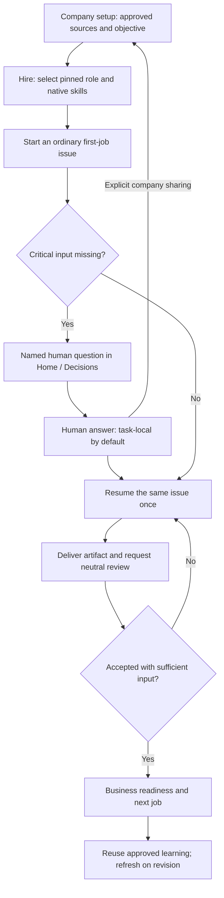

# Workforce templates and company onboarding — research and discussion draft

**Date:** 2026-09-29

**Status:** Launch must-have requested by the founder. Research and live discussion are recorded below; implementation authorized September29 and now underway on `codex/workforce-onboarding-20260929`. Earlier “not started” statements describe those dated research checkpoints.

**Launch:** October 28 waitlist launch with cap ten. This requirement is an additional release gate.

## 1. Target result

A person hires a marketing, sales, operations or customer-support agent. The agent arrives with a tested way to do that job, learns this company’s approved information, identifies the facts or access it still needs, and asks focused questions. Answers become durable company knowledge. The agent then completes assigned work and supplies a verifiable result. It must distinguish a finished draft from a published campaign, a researched prospect from a sent email, and a proposed refund from an executed refund.

Recommended product promise: **a trained starting point for the role, company-specific preparation, and evidence that the work was completed.** Template instructions alone do not demonstrate improved task completion; evaluations must compare actual outcomes.

## 2. What the research supports

| Primary evidence | Verified pattern | Implication for AgentDash |
| --- | --- | --- |
| [Alibaba Cloud AgentCore templates](https://www.alibabacloud.com/help/en/agentcore/manage-agent-templates), updated September 17, 2026 | Reusable configuration packages contain SOUL.md/AGENTS.md, bound skills and optional subagents. | Keep role instructions and capabilities versioned and reusable. This documentation does not itself prove agents learn a company or ask the right questions. |
| [AgentTeams worker discovery](https://github.com/agentscope-ai/AgentTeams/blob/main/manager/agent/skills/agentteams-find-worker/SKILL.md) — current repository reached through former HiClaw URL | The manager searches worker packages by task requirements, recommends matches and imports a selected package; failed imports are reported rather than silently replaced. | Let the CoS match a hiring request to a known template and show its identity. Retain a custom-agent path with clear provenance. |
| [Alibaba skills](https://www.alibabacloud.com/help/en/skillsportal/understand-agent-skills) and [memory spaces](https://www.alibabacloud.com/help/en/agentcore/manage-memory-space) | Procedures load when relevant; memory is written and retrieved explicitly, with scope isolation. Skills do not override runtime permissions. | Separate reusable job procedures, company facts and agent experience. Load relevant context, and enforce company/access boundaries outside prompts. |
| [Anthropic marketing draft workflow](https://github.com/anthropics/knowledge-work-plugins/blob/main/marketing/skills/draft-content/SKILL.md) | Collects audience, message and format; uses configured brand voice, asking for missing input. | A marketing template needs a company/brand intake and task-specific missing-input check. |
| [Anthropic sales outreach workflow](https://github.com/anthropics/knowledge-work-plugins/blob/main/sales/skills/draft-outreach/SKILL.md) | Grounds work in available company/CRM/history data, asks for a missing fact, distinguishes connected tools from file-based work, and returns a concrete draft/result. | Templates must account for actual tool access and deliver useful outputs when inputs are uploaded files. Do not promise a live CRM/send action without the connector. |
| [Brand guideline generation](https://github.com/anthropics/knowledge-work-plugins/blob/main/partner-built/brand-voice/skills/guideline-generation/SKILL.md), partner-authored in Anthropic’s repository | Derives guidance from sources and exposes unresolved contradictions/questions with recommendations. | Store source references and unresolved questions; inferred guidance requires confirmation before becoming company policy. |
| [Anthropic agent evaluation guidance](https://www.anthropic.com/engineering/demystifying-evals-for-ai-agents) | Evaluates end states and interaction quality, repeats trials, and tests both appropriate and inappropriate behavior. | Grade completed work, targeted clarification, retention and incorrect action prevention. Asking more questions or writing longer prompts is not a success measure. |

These are architecture and workflow precedents. They are not comparative proof that Alibaba or any other product completes our customers’ tasks better. I have not verified which specific Alibaba demonstration prompted this request.

## 3. Existing AgentDash foundations and gaps

A separate repo map records exact functions and lines: `AGENTDASH-WORKFORCE-TEMPLATES-REPO-MAP-2026-09-29.md` in the takeover folder.

- The standard instruction bundle is deliberately shared across roles. A role currently supplies routing/display context; it does not create a tested role curriculum or authorization.
- Single-agent interviews, team onboarding, ordinary board hires and assistant-gated hires have separate materialization paths. All must resolve the same template/version and company-learning contract. Templates should layer onto the shared worker mandate; occupational title must not grant authority.
- Existing company-context records support source/confidence/verification, but their current consumers are assessment/research. A scoped runtime-reading path and an explicit source/revision contract are still needed for hired agents. Existing revisioned documents can hold an approved company brief.
- Existing `ask_user_questions` provides durable, company-scoped questions and response-driven resumption. Creating a question alone does not guarantee dispatch is held; a real task readiness boundary is required.
- The general question card currently accepts selected choices, not free-text prices, dates or business descriptions. Required launch inputs need an explicit answer contract or a reliable conversation/comment fallback; they cannot be collected by prompt changes alone.
- Agent memory and skill context already reach heartbeats. Reuse them for relevant learning and procedures, preserving the rule that memory and retrieved content cannot grant permissions.
- MK agent-fact requests are workflow/run-scoped and profile-specific. The default hosted launch needs its own explicit applicability rather than copying the MK behavior into every company.

**Recommended approach:** extend the current hiring, context, question and task infrastructure. Keep adapter-neutral instructions and platform-enforced access. A framework replacement or third-party template installation is unnecessary for this launch feature.

## 4. Proposed launch scope

### A. A small, reviewed role catalog

Propose four starting roles; confirm the set in our conversation.

| Role | Required company learning | First completion proof |
| --- | --- | --- |
| Marketing generalist | Offer, target audience, approved claims, brand voice, channels, campaign objective | A campaign brief and channel-ready assets matching the approved facts, with references and an explicit publication state. |
| Sales development | Customer profile, product/pricing, qualification rules, territory, messaging, contact/send authority | Qualified prospect research and a personalized outreach draft; record/send only when the configured action is authorized. |
| Operations coordinator | Services/workflow, owners, systems, operating rules, escalation paths | A completed operational task with an updated record or an actionable deliverable and its receipt. |
| Customer support | Product/help material, support policy, service commitments, refund/escalation boundaries | A grounded response or resolved case with evidence, escalating policy exceptions to the responsible person. |

Each template defines responsibilities, expected inputs, procedures/skills, output types, quality checks, handoffs, escalation conditions and task completion criteria. Generic examples must never become company facts. Record template ID/version at hire; updates are reviewed and applied explicitly so active agents are not silently changed.

### B. Company learning before dependent work

The agent first reads authorized company knowledge and relevant task/project material. It produces a short company brief with references, known gaps and conflicting sources. CoS shares existing answers so every hire does not repeat the company interview.

Facts record scope, source, recorded/updated time and confirmation status. Distinguish human-confirmed facts from agent inferences. A human answer that corrects pricing or policy supersedes older conflicting guidance; the old source remains traceable. Updated, revoked or newly restricted sources invalidate affected learning. Restricted material stays restricted during retrieval, storage and prompt assembly.

### C. Focused clarification and durable answers

Search existing knowledge before asking. For a missing fact that affects the result, explain what is needed, why it matters and the recommendation when one can be responsibly offered. Group a small number of related blockers instead of sending an exhaustive questionnaire.

A question names its answer owner and affected task/step. Persist it, show it in the existing human inbox, and deduplicate repeated questions across runs. An answer updates the relevant company context and resumes the held work exactly once. No answer must not cause polling loops, repeated spending or invented facts.

Only the dependent work pauses. An agent may continue independent research or prepare a clearly labeled draft when that is permitted and useful. Critical missing product facts, contradictory prices and missing send/refund authority must block the affected action.

### D. Visible readiness and completion

People can see: learning company context, needs your input, ready for the requested work, working, and completed with evidence. These can reuse existing task/onboarding state; the final schema choice remains open for discussion.

Before execution, validate task-specific knowledge, configured tools and action authority. Before completion, check the deliverable against role criteria and attach the artifact/record/receipt. An independent review or deterministic check should verify important outputs; an agent saying “done” is not sufficient.

## 5. Launch acceptance and evaluation

Use at least two materially different company fixtures per launch role. Reuse the same generic template; demonstrate different correct outputs based on each company’s knowledge. Run repeated model trials on the hosted Hermes path, plus prompt-contract checks for the other supported adapters. Keep this feature’s evaluation fixtures separate from the protected Monica V77/holdout materials.

Required scenarios:

1. Complete knowledge: produce and verify the requested artifact without needless questions.
2. Missing critical input: ask the appropriate owner and avoid the dependent action; continue permitted independent work.
3. Answer/resume: persist the answer, resume once, finish the original task and avoid asking again after restart or a new agent hire.
4. Conflicting/stale material: cite the conflict and obtain a decision; do not silently choose a price or policy.
5. Missing tool/access: describe the actual capability and deliver a useful draft when allowed; never claim a sent/published/executed result.
6. Restart, duplicate answer and retry: no lost learning, duplicate external action, budget loop or abandoned task.
7. Cross-company/restricted context and instruction-like source content: no leakage or capability expansion.
8. Template version change: provenance stays visible and existing overrides remain intact.
9. Every supported hiring path installs the same selected template; instruction refresh retains the role layer. Source changes invalidate affected readiness without stopping unrelated work.

Release gates: all deterministic isolation, authorization, idempotence and state-transition tests pass; every advertised role has dated completion evidence; no unresolved critical completion defect. Before launch we must choose an outcome pass target and a cost/latency budget from the baseline. A proposed 90% completion target is a discussion starting point, not a measured result or guarantee. Track unnecessary questions, successful resumes, repeated questions, false completion claims, human corrections and cost per completed task alongside completion rate.

## 6. Example conversation to validate

**Person:** “Hire a marketer and prepare our launch campaign.”

**Agent:** “I found our product brief and brand guidelines. I can prepare the campaign assets. The launch date differs between two documents, and I cannot find the campaign audience. Which date is current, and who are we targeting?”

**Person:** Supplies the answers.

**Agent:** Saves the confirmed facts with their source, resumes the campaign, creates the assets, checks claims against the product brief, and returns links plus what remains for publication.

**Next hire/task:** Reads the confirmed launch date and audience without repeating those questions.

## 7. Live conversation agenda

1. Which roles must be usable at launch? Marketing and sales are explicit; are operations and support also required?
2. Does company learning happen mainly once through the CoS, once per hire, or only as each task needs it? Recommendation: shared company intake with role/task-specific gaps.
3. What must an agent finish autonomously at launch, and what should require a human decision? Choose concrete first jobs rather than broad role labels.
4. Who answers questions, and how should they appear in the founder/team inbox?
5. Which two real companies and representative tasks should prove this works, and what completion/cost target is acceptable?

After that discussion, finalize the requirements, assess the launch schedule, create the implementation/test plan and add the agreed work to the launch backlog. No feature code has been started.

## 8. Live discussion notes — September 29 (ongoing)

Founder requirements clarified in the live conversation:

- Autonomy must produce work customers consider useful and high quality. Role instructions alone are insufficient.
- Agents need relevant company context, clarification when uncertain, reusable skills and existing company assets.
- The product should support capable departments/teams, including the example of a sales operation a company does not currently have. This does not yet commit a launch role set or a promise to close sales.
- Each department has different OKRs, KPIs and ways of measuring success. Sales is an example, not a universal evaluation model; marketing and engineering need their own standards.

Design implication proposed for discussion: each department template includes responsibilities, procedures, deliverable quality checks and candidate success measures. Company onboarding establishes the actual objective, baseline, target, time window, measurement source and responsible owner. Assign these to the team and individual roles without treating template defaults as the company's approved goals. Track artifact quality and workflow reliability alongside department outcomes, including factors outside agent control.

Illustrative measures, not fixed launch promises: marketing campaign quality and qualified demand; sales qualified pipeline, conversion and revenue when within its remit; engineering accepted working changes, defects and delivery time. The final department scope, company targets and evaluation thresholds remain open in this conversation. Feature implementation has not started.

## 9. Live discussion: customer wedge and real completion

Founder clarification: target small/medium business owners and team leads who want to grow but lack budget for additional human teams. Start with small, valuable tasks humans struggle with or dislike, and prove high-quality autonomous completion. Departments retain distinct OKRs/KPIs. Company context, targeted questions, crafted skills, existing assets, coordination and feedback must support actual deliverables. The local steward/harness bridge is a proposed advantage to demonstrate in the workflow. Quality and affordability must be tested on the models and tool configuration we actually intend to operate; skills alone do not guarantee sufficient model capability.

Research is underway on narrow workflow hypotheses, required access and terminal completion proofs. Illustrative candidates are warm inquiry through a qualified proposal and tracked follow-up, meeting decisions through completed follow-through, and approved company material through finished marketing assets. These are hypotheses, not validated customer demand or committed launch scope. Agree one reachable customer segment and representative task before expanding the catalog.

Proposed pilot evidence: use real consented customer tasks with independent quality review; record terminal artifacts/actions and correct escalation; measure accepted completion, human correction/time, elapsed time and total model/tool cost. Compare against the customer's existing workflow and an ordinary assistant supplied equivalent inputs. Separate task completion from delayed business outcomes such as revenue, and verify any promised local bridge/tool actions. No workforce feature implementation has started. The transcript's Muse/MetaMuse competitive reference is ambiguous and its identity/success claims remain unverified.

## 10. Candidate: AI workforce onboarding and migration

The founder suggested migration or onboarding AI agents itself as a task. Migration's source/destination remain an optional clarification: existing agents/workflows into AgentDash, company assets into agent-ready knowledge, or business-tool migration. These have different contracts and should not silently become one large feature.

Proposed onboarding outcome: **company context to the first accepted useful job**, followed by a second job that reuses the learning. The flow establishes the company owner, selected role, first task and allowed systems; reads permitted sources; produces a sourced brief; applies a versioned role template and relevant skills; validates actual capabilities; asks focused blocking questions; stores answers and resumes; completes the first task; and returns reviewed artifacts/action receipts. The department's OKRs/KPIs remain company-specific. Creating an agent or displaying a setup-complete status alone is not acceptance evidence.

Measure time to first accepted job, human correction minutes, false completion claims, clarification/resumption reliability, total setup/job cost and the improvement on the second similar task. Interpret question counts alongside necessity and answer quality; fewer questions can be worse when information is missing.

This candidate directly supports the launch must-have and may be a practical front door to the eventual department offering. It still requires a specific first job and demand validation; it is not an approved promise that every role/business can be onboarded automatically. Keep permission/connector prerequisites explicit. Current repo findings indicate MK-only laptop execution, agent-blocked Gmail draft/send, and missing Calendar/Outlook execution integration; await the exact capability map before setting launch scope. No workforce feature code has started.

## 11. Consolidated launch verdict

**Must-have:** reusable, versioned role templates and skills with company learning, targeted clarification, durable answers and verified task completion. The initial product wedge to test is **onboard an agent through its first accepted useful job**, then prove reuse on a second similar job. Template files alone do not satisfy the founder's requirement.

Recommended minimum:

1. A bounded reviewed role catalog. Marketing and sales-support are the proposed first roles, with explicit starter deliverables such as repurposing approved company material into usable campaign content, or qualifying an inquiry and producing an accurate proposal/outreach packet. These are proposed scopes, not a promise of full department automation or an approved role count.
2. Each role defines responsibilities, applicable skills, required facts/assets, output standards, escalation and candidate metrics. Company onboarding sets the actual department OKRs/KPIs, owner, baseline and targets.
3. Read permitted company sources and existing assets, record provenance/confirmation/revision, identify gaps and contradictions, and reuse prior answers. Knowledge and templates cannot grant permissions.
4. Persist focused questions with a responsible human; hold only dependent work; resume exactly once after sufficient answers. Test free-text business input and comment fallback, not only choices.
5. Deliver a customer-accepted artifact/action with an explicit completion state, quality review and receipts. Grade first-job completion, human correction time and full model/tool cost on the actual intended configuration. Compare against competent ordinary-assistant use with equivalent context and available permissions/tools.
6. Repeat on a second job and across different company fixtures: learning persists, company-specific outputs differ appropriately, and questions/actions are not duplicated. All deterministic company/visibility, authority, source-use, retry and state-transition gates pass. Numeric quality/cost targets are set from the baseline; none has been approved or measured yet.

**Verified capability boundary:** the personal laptop execution bridge is MK-only at main347ffaea5. Assistant OAuth/MCP is scoped control-plane coordination, not laptop execution. Gmail draft/send rejects agent actors; default agents cannot assume access to human-private Gmail connections. Native Calendar/Outlook execution was not found, and HubSpot is MK-only. The unattended bridge worker currently returns capped text and removes generated workspace files, rather than uploading file artifacts. Standard hosted launch jobs must fit available execution/return paths; broader bridge support or connector actions require their own scoped implementation and evidence. See `AGENTDASH-LAUNCH-BRIDGE-CAPABILITY-MAP-2026-09-29.md` in the takeover folder.

Migration remains a candidate entry path pending its source/destination definition. It is not required to resolve that optional branch before planning the core onboarding mechanism. Demand and pilot access remain unconfirmed; feasibility fixtures and customer discovery run in parallel. No workforce implementation, customer outreach or launch-gate activation has occurred.

## 12. Proposed integration with product features and experiences

Use one company-learning and role-application flow during company setup, hiring and everyday tasks. Existing CoS conversations, hiring approvals, skills, tasks, human inbox, documents/memory and goals provide the entry points. This is a proposed integration design, not implemented behavior.

| Existing experience | Proposed addition | Visible result |
| --- | --- | --- |
| Company setup / CoS intake | Establish the first useful job and company objective; accept permitted documents/assets or approved imports; assemble a sourced brief with explicit gaps. | The person sees what the agent learned, what needs input and the job it will prove first. Interview length or successful agent creation does not certify business readiness. |
| Hire an agent / assemble a team | Match the request to a reviewed role template, preview responsibilities, skills, expected deliverables and requirements; derive proposed OKRs/KPIs from the company goal. Apply the same selected template/version through all hiring paths. | A hire arrives with a clear remit and visible readiness. Existing capacity, hiring approval, stewardship and governance still govern creation and actions. |
| Assign work / task execution | Attach a role-specific definition of success; retrieve current allowed knowledge and skills; check required facts, tools and authority. Hold only work that depends on a missing input. | Task cards explain the next action, input needed, tool/approval limitation and expected result. Other permitted work continues. |
| Human inbox / conversation | Show a focused question, its responsible person and affected task. Accept the necessary typed/free-text input; persist the answer with provenance and resume the exact job once. Tool authorization follows the existing approval mechanism rather than being inferred from a factual answer. | A person answers in the ordinary inbox; the agent remembers the answer and continues without repeated polling or duplicate actions. |
| Task review / completion | Check the actual deliverable against role/company standards and existing DoD/verdict conventions; attach accessible artifacts/action receipts and an explicit draft/approved/executed state. | The first job ends with useful, reviewed work. A setup-complete indicator or the agent's own success statement does not substitute for the artifact. |
| Ongoing work / goals / briefing | Retain confirmed company learning, apply feedback, check source changes and report department outcomes alongside output quality, correction time and cost. | The next job reuses learning; company changes refresh only affected knowledge. Business KPIs are sourced from real records and remain unknown when their measurement source is unavailable. |

### Example

A person asks the CoS to hire marketing help and repurpose an approved product announcement. The CoS matches a marketing-content template, installs relevant procedures, links the current brand/product sources, and proposes the first job and quality criteria. The worker finds the intended audience missing and files one question in the ordinary inbox. The answer is saved as approved context; the same task resumes, produces usable channel-ready content with the applicable assets, and receives a quality check. The person sees the deliverables and publication state. A later campaign reuses the audience/brand information and the person's corrections, with different task-specific questions when needed.

### Shared implementation seams

- **Role templates:** one versioned role layer applied by single-hire, team onboarding, board hire and assistant-gated hire. Preserve the shared worker mandate and human customizations; template identity is independent of display/routing role and grants no capability. Template upgrades need an explicit compatibility/override policy.
- **Knowledge:** a sourced approved company brief plus separately scoped project/private material, read at runtime. Keep shared approved facts distinct from an individual agent's learned summary and experiences. Source revision/revocation invalidates affected cached learning, and visibility is enforced before retrieval and prompt assembly.
- **Task readiness:** company understanding, adapter readiness, hiring approval and execution authority are distinct checks. A question holds the dependent task with defined answer/cancel/retry semantics, not the entire company. Waiting must not consume recurring task runs.
- **Questions:** extend the existing interaction/resume contract as needed for business facts and named ownership. Preserve company scoping, idempotence, correct actor identity and audit records. A comment fallback needs explicit association/resolution; arbitrary text must not silently grant permissions or mark a task ready.
- **Quality and reporting:** install role-specific acceptance criteria and verify real artifacts through current review/DoD surfaces. Link department KPIs to company goals and actual data, while tracking task-quality/effort separately. Measure the second job's reuse benefit.
- **Steward/harness:** retain the current profile and authority boundaries. The MK laptop bridge can participate where configured. A standard-hosted bridge or additional connector action is separate scoped work requiring actual execution/artifact-return evidence; importing a template must not enable it implicitly.

Smallest new work: the shared template/version application, runtime company-context delivery, explicit question/task readiness/resume semantics, role quality checks, and the necessary UI status/input/reporting additions. Reuse existing skill storage, documents/memory, hiring/approval, tasks and human interactions. No framework replacement or dependency addition is proposed.

## 13. Authorized implementation — September29

The founder directed: “integrate this requirement back to the launch ready checklist and build.” The [implementation plan](2026-09-29-workforce-onboarding-implementation.md) and required WF-1 through WF-8 gates in [the launch checklist](../LAUNCH.md) now govern delivery. Initial templates are marketing-content and sales-support; enrollment links optional existing company goals and declared metrics, preserving department-specific success measures.

Build acceptance covers every hiring path, current explicitly shared company knowledge, substantive native skills, durable text questions with named ownership, dispatch holds and exact-task resumption, first-job artifact and neutral review, second-job/new-hire reuse, company/privacy isolation and the integrated UI. Actual intended-model output quality, customer acceptance and cost remain separate evidence gates. Isolated local implementation does not activate customer or production launch.

### Build path across existing experiences

Runtime capability, action approval and budget remain separate gates on execution. Declared department targets remain targets until actual results are recorded. The ordinary issue, artifact and review systems provide the completion evidence.

## 14. Human-facing API/MCP/bridge parity — September29

The founder added: “all the human facing pages needs to be available via api/mcp/bridge.” Each human-facing workflow needs usable API contracts and equivalent MCP/human bridge read/action paths. This includes company knowledge and proposed-fact review, hiring/role previews, department targets, readiness/start/retry and the ordinary questions/review experience. An existing REST endpoint alone does not prove transport availability.

Audit existing launch pages as well as the new workforce experience; record coverage and close uncovered launch operations. Preserve authenticated human identity, company/source visibility, scoped grants, confirmation/replay protection and audit. A factual answer or role import cannot grant permissions; an agent cannot impersonate a pinned human answer owner. This expands control-plane transport coverage, with laptop execution and external connector actions retaining their existing capability boundaries.

### Local human transport decision

For this build, API parity uses the existing canonical routes; MCP parity uses an explicit local `human` toolset; bridge parity uses a distinct typed human control-plane bridge. The trusted harness connects with the existing named-human browser-approved CLI credential. Selection and prepared actions pin the target, while live membership, role and source checks remain authoritative. This does not narrow the underlying board credential or upgrade every OAuth assistant client. Existing OAuth company grants, actual consent ceremonies and MK laptop endpoint/lease authority remain intact.

Coverage includes every shipped human page's allowed actions, with file/content transport and continuation of real login, consent, invite and claim ceremonies where needed. A ceremony link remains pending until its actual approval/completion is observable. Static pages need usable canonical content resources; dynamic plugin actions require explicit reviewed transport contracts. The [coverage ledger](2026-09-29-human-control-plane-transport-coverage.md) tracks gaps and test evidence.

## 15. Required question-owner recovery — September29

A required question must remain recoverable when its pinned answer owner leaves the company. A real local PostgreSQL/HTTP characterization reproduces a stranded pending question: the old owner is inactive, the new accountable person cannot cancel it, replacement requires cancellation, and a keyless requirement cannot be satisfied by approved company facts. This is an unresolved launch blocker.

Provide a workflow for the current named active human selected by canonical accountability: discover only eligible recovery metadata, explicitly confirm cancellation, receive a safe receipt, create the existing canonical replacement question for the current owner, and answer/resume the same task. The UI must make this entry available even when the full readiness response is private. API, MCP and human bridge must support the same workflow with current source/project/membership checks, audit and one-attempt recovery semantics.

This does not authorize another person's answer or private payload, synthesize an answer, restore the former member, mark the agent ready, or retry an uncertain cancellation. Existing strict question read/respond contracts remain. Reactivating the old owner or changing the current accountable human before acceptance invalidates stale recovery intent. The new operation must preserve the existing twenty foundation operation IDs, versions and schemas; additional recovery operations need explicit typed contracts and registration. Exact implementation ownership and proof are frozen in the recovery task after the current core checkpoint is reviewed.
