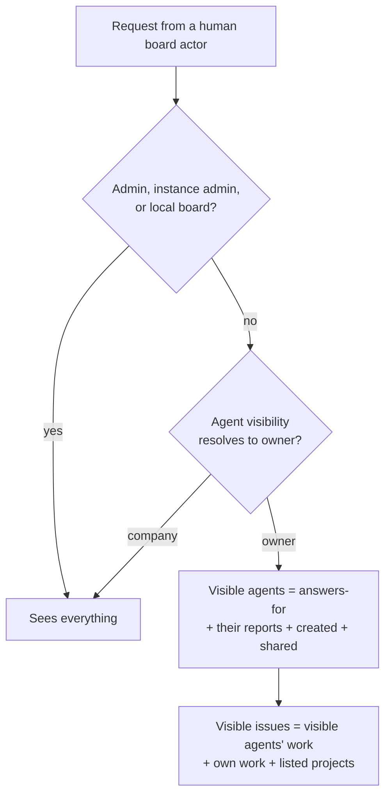

# Agent visibility: members see the agents they answer for

2026-09-30 · Yang · **Draft for review** · Asked for by a design-partner steward: "only admins can see all agents and their tasks; a regular member should only be able to see their own agent."

A company admin keeps seeing everything. A member sees the agents they answer for, those agents' work, their own work, and every issue in a project they are listed on. Everything else is nonexistent to them — 404 on the id, absent from every list — the same rule restricted projects already enforce. One company setting turns it on; one per-agent override and the existing project access list give an admin the sharing they need. No new permission keys, no new access table.

## What exists today

Admins and members see the **same** agents and issues. They differ only in detail (configuration is redacted for members) and in what they may change. `doc/SPEC.md` states the inherited principle: "Full visibility across the org." The one rule that hides anything from a person is the restricted-project rule (A5), implemented in `server/src/routes/visibility.ts`:

- `seesEverything(req, companyId)` — company admins, instance admins and the local board are exempt from every rule.
- `projectScopedVisibilityCondition(req, companyId, col)` — a SQL condition composed into every list query by the service (`visibleWhere`), never derived by it.
- `assertIssueIdVisible` / `issueVisibilityParam` / `runVisibilityParam` — 404 on every id route, including sub-routes, approvals, runs, workspaces, the activity feed and websocket live events.
- Agent actors are subject to it too, matched against `project_access` as principals.

"The person who answers for an agent" is also already defined: `agent-accountability.ts` resolves a stewarded agent to its active steward and an autonomous agent to `accountableUserId`; `steward-inbox.ts` (`agentsAnsweredForBy`) already scopes a person's inbox by it. The design reuses both.

## The rule

**Agent visibility.** Each agent resolves to `company` or `owner`: the agent's own `visibility` if set, else the company's `agentVisibilityDefault`. A `company` agent is visible to every member, as today. An `owner` agent is visible to a member when any of these hold:

| Visible because | Source of truth | Why it is in |
| --- | --- | --- |
| They answer for it | active stewardship, or `accountableUserId` for an autonomous agent | The product's definition of "my agent" |
| It reports to an agent they answer for | `agents.reportsTo`, transitively | A Chief of Staff's steward sees the agents under it; without this the org a person runs is half-hidden |
| They created it | `createdByUserId` | A member can create several agents and steward one; "I made it and cannot see it" is a support ticket |
| An admin marked it `company` | per-agent override | The company's shared agents (a CoS everyone works with) stay visible without touching the rule |

**Issue visibility** composes with the project rule (both must pass). In `owner` mode an issue is visible to a member when any of these hold:

| Visible because | Column |
| --- | --- |
| A visible agent is assigned to it or created it | `assigneeAgentId`, `createdByAgentId` |
| They are assigned to it or created it | `assigneeUserId`, `createdByUserId` |
| It is in a project they are listed on or created | `project_access`, `projects.createdByUserId` — the existing A5 list |

An issue with no agent, no project and not theirs is not visible. The project access list is therefore the admin's sharing knob for *work*: list a member on a project and they see all of it, whoever's agents are in it. Decided 2026-09-30 over two alternatives — "own work only" (too strict: no way to share), and "own work plus every unassigned issue" (issues vanish when assigned, which reads as a bug).

**Who the rule applies to.** Human board actors only: `session`, `board_key`, `assistant_grant`. A person's CLI key and OAuth assistant narrow with the person — that is correct, they are the person. Agent actors (`agent_key`, `agent_jwt`) are **not** affected: agents keep full org visibility as the spec says, and the restricted-project rule keeps governing them as it does now. The evaluator principal is read-only and unaffected.

**What a member sees of an invisible agent on a visible issue.** The issue row keeps the assignee's name and kind badge, as it does today, because that is attached data on the issue. Opening the agent is a 404, exactly as a restricted project's issue is to an off-list actor. Accepted: it is consistent with A5 and the alternative — hiding assignee names — makes the issue list lie about who holds the work.

## Settings: two knobs, both admin-only

| Knob | Where | Values | Default |
| --- | --- | --- | --- |
| Company default | **Settings → Access → Agent visibility** | *Everyone sees every agent* (`company`) · *People see the agents they answer for* (`owner`) | `company` — nothing changes on upgrade |
| Per-agent override | Agent page → Access (admin only) | *Company default* · *Everyone* · *Only the people who answer for it* | inherit |

That is the whole surface. No per-member settings, no new permission keys, no new access table. Sharing *work* with a member is the existing project access list — which today has `GET`/`PUT /projects/:id/access` on the server and **no editor in the UI**; that editor is in scope here, because option 3 depends on an admin being able to list a member on a project.

## Server changes

| Change | Where | Notes |
| --- | --- | --- |
| Schema | migration `0141_agent_visibility` | `agents.visibility text null` (`company` \| `owner`; null = inherit) and `companies.agent_visibility_default text not null default 'company'`. Two columns, no backfill |
| `visibleAgentIds(req, companyId)` | `routes/visibility.ts` | The set for a human actor in `owner` mode: answers-for ∪ transitive `reportsTo` descendants ∪ created ∪ per-agent `company`. One query with a recursive CTE; cached per request |
| `agentVisibilityCondition(req, companyId, agentIdColumn)` | `routes/visibility.ts` | SQL condition, `undefined` for admins, same shape as `projectScopedVisibilityCondition` |
| `assertAgentIdVisible`, `agentVisibilityParam` | `routes/visibility.ts` | 404 on every `/agents/:id*` and `/companies/:companyId/agents/:agentId*` route, non-canonical ids included |
| `issueVisibilityCondition(req, companyId)` | `routes/visibility.ts` | `and(projectScoped, agentScoped-or-mine-or-listed)`; the service composes it, as today |
| Agent lists and reads | `routes/agents.ts` list, detail, `org`, `org.svg/png`, configurations, config-revisions, skills, instructions-bundle, runtime-state, task-sessions, keys | Lists filter; id routes 404. **Also fixes the existing inconsistency**: `assertCanReadConfigurations` returns early for any member (`assertCanCreateAgentsForCompany`), so configuration, skills and bundle routes admit members the list redacts — they should require `agents:create` as the list does |
| Stewardship, memory, governance, directives, fact requests | `routes/agent-stewardships.ts`, `agent-memory.ts`, `agent-governance.ts`, `agent-directives.ts`, `agent-fact-requests.ts` | `agentVisibilityParam` on the agent id; the existing steward/creator/accountable checks stay on top |
| Runs | `heartbeat-runs`, `live-runs`, `/heartbeat-runs/:runId*` | `and(runVisibilityCondition, agentVisibilityCondition(heartbeat_runs.agent_id))` |
| Issues | `routes/issues.ts` list and the `router.param` guards; `services/issues.ts` `visibleWhere` | The composed condition. Create/PATCH refuse an invisible `assigneeAgentId` with 404 |
| Approvals | `routes/approvals.ts` list and detail | Filter on `requestedByAgentId`; linked-issue list already filtered by project |
| Dashboard, sidebar badges, activity, evaluation, working-now | `services/dashboard.ts`, `sidebar-badges.ts`, `activity.ts`, `evaluation.ts` | Counts and feeds take the condition; an invisible agent's activity rows are omitted, as restricted-project rows are |
| Live events | `realtime/live-event-visibility.ts` | Same predicate as the HTTP side |
| Settings routes | `PATCH /companies/:id` (admin) for the default; `PATCH /agents/:id` (admin) for the override | Both gated on `isCompanyAdministrator`; both logged to the activity feed |
| Costs | — | Already admin-only (`assertSpendVisibility`); nothing to do |
| MK inbox, `/me/agent`, waiting-on-you | — | Already scoped to the caller; nothing to do |

## UI changes

- **Settings → Access**: one radio group, "Agent visibility", with the two sentences above and a one-line explanation of what a member will and will not see. Admin only.
- **Agent page**: one select under Access, admin only. Shows the resolved value and whether it is inherited.
- **Project page**: "Who can see this project" — the access-list editor the server already has routes for. Admin only. Members listed here see every issue in the project.
- **Everything else changes by itself.** Agents, Org, Sidebar agents, Command palette, the agent pickers in issue and goal forms, Activity, Dashboard and Issues render what the server returns; none of them does role logic today and none should start. Thirty-two call sites of `agentsApi.list` keep working unchanged.
- **Org chart** for a member in `owner` mode shows the subtree they can see. The agent they answer for is the root when it has reports.
- **`/guides/board-operator/onboard-a-steward`** gains one paragraph on the setting, and **Agent kinds & stewardship** one line: in `owner` mode an unpaired agent is visible to admins only until it is paired.

## Tests

- `server/src/__tests__/agent-visibility.test.ts`, real Postgres, modelled on `project-visibility.test.ts` (`appAs`, `asUser(id, role)`, `asAgent(id)`): a member in `owner` mode lists only their agents (steward, accountable, reports, created, shared); every agent id route returns 404 for an invisible agent, by id and by key, hyphenless and braced ids included; issues follow the three clauses and still obey the project rule; a member listed on a restricted project sees its issues but not the agent pages behind them; create and PATCH refuse an invisible assignee; an admin, the instance admin and the local board see everything; an agent actor sees everything it saw before; `company` mode is byte-for-byte today's behaviour; flipping the per-agent override moves one agent across the line without touching the rest.
- The suites that pin today's open behaviour update to assert it **in `company` mode**: `agent-permissions-routes.test.ts` (member list/detail), `project-visibility.test.ts` (member issue list), `agent-steward-visibility.test.ts`.
- `live-events-project-visibility.test.ts` gains the agent cases.
- UI: the two controls and the project access editor get tests; `Agents.test.tsx`, `SidebarAgents.test.tsx`, `OrgChart.test.tsx` get one case each with a filtered list, proving nothing in them assumes the full set.
- A source-level wiring guard, like `costs-service.test.ts` has for `/by-issue`: every route that lists agents or runs passes the condition, so a new route cannot forget it.

## Rollout

1. Migration and the `visibility.ts` helpers with the real-Postgres suite — one pull request, no behaviour change (default `company`).
2. Routes and services take the condition; the configuration-route fix rides along — one pull request.
3. The three UI controls and the guide text — one pull request.
4. On the design partner's instance: an admin flips **Agent visibility** to *People see the agents they answer for*, marks the shared agents `Everyone`, and lists the members who need project-wide views. A member confirms they see their agent and nothing else; an admin confirms nothing changed for them.

Effort: estimated at 4–5 working days for one person, most of it the route sweep and its tests — the same shape as #854. Estimate, not a measurement.

## Risks and what was deliberately left out

- **Behaviour change is opt-in.** Nothing changes until an admin flips the default. An instance that never flips it is unaffected by every pull request above.
- **The sweep must be complete.** A5 needed three follow-ups (#854, #864, #868) to reach every surface. The wiring guard and the id-route `router.param` pattern are how this one avoids that; the risk is a surface neither covers (a new route, a plugin page).
- **Assistant and CLI narrow with the person.** A member's assistant will stop seeing other agents. Correct, and worth one line in the release notes.
- **Not in scope:** per-member visibility lists (the project list is the sharing mechanism); hiding assignee names on visible issues; restricting agent actors; a "view" permission key (`tasks:assign_scope` exists, is unenforced, and stays that way — a new key would default to nobody holding it).

## Open questions

- Should the `reportsTo` subtree count? Proposed yes — it is the org a steward runs. If the design partner would rather a steward see exactly one agent, drop that row; it is one clause.
- Should an admin be able to make a single *member* see everything without making them an admin? Proposed no; that is what admin means here, and two human roles was a deliberate 2026-08-16 decision.
