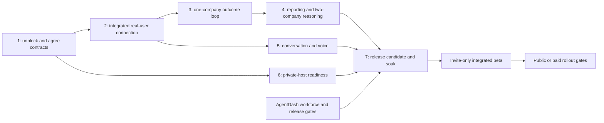

# Monica, Ross and AgentDash Launch Plan

> **For agentic workers:** Use `superpowers:executing-plans` or `superpowers:subagent-driven-development` for bounded implementation packages. Follow repository authority, ownership and verification rules. Checkboxes record demonstrated completion, not intent.

**Goal:** Launch a useful executive OS in which Ross understands authorized companies, advises their leads, follows work to evidenced outcomes, and answers through Monica or a user's chosen assistant, with AgentDash as the governed system of record.

**Architecture:** Keep company execution, permissions, approvals and source records in AgentDash. Ross reasons with exact `glm-5.3-flash`, maintains derived sourced knowledge and reconciles company-lead updates; portfolio reasoning composes independent authorized company scopes outside company-readable memory. Monica is the reference conversational interface; supported alternative assistants connect through the same scoped contracts. Assistant choice never changes company authority.

**Tech stack:** Existing AgentDash TypeScript/Express, PostgreSQL/Drizzle, React, MCP/OAuth; Hermes/GLM runtime; existing Monica/Qwen conversation and speech seams; existing native-host supervision and private networking. Reuse current packages and primitives; no new dependency is prescribed.

**Spec:** Operating model (operator-private source, not in repo), hosting acceptance (operator-private source, not in repo), conversation/voice acceptance (operator-private source, not in repo), and the shipping lane's `doc/LAUNCH.md` including WF-1 through WF-8. The user's later direction makes Monica replaceable; it does not remove Ross's executive role.

## Launch scope and current baseline

Default first audience: invite-only design partners. This is a planning assumption, not a deployment authorization. An internal one-company demo is a milestone; it is not completion of this launch or the full Ross objective.

The invite-only integrated beta must have: a real user; useful one-company execution; two independently authorized real companies with portfolio reasoning; ongoing reporting; a working Monica text/voice path; one genuinely connected alternative assistant; private-host recovery; and the applicable AgentDash product/release gates. Public/paid rollout additionally depends on the full shipping checklist, billing/claim/security acceptance and product support readiness. Do not market untested assistants as supported.

As of September 30:

- Actual supervised GLM runs, scoped lead/Ross records, private session recovery, source history, backup and provider-outage behavior exist.
- Real goal/context records are readable. Prior model runs did not consume the newly linked context.
- An additive nine-file shipping integration patch passes local applicability, isolated real OAuth, MCP217, typecheck/build and independent review. It is not landed or deployed.
- Installed assistant target/identity remain unresolved; an old connector probe failed before identity. Local3100 metadata is loopback-only.
- <review task> has persisted recovery-budget exhaustion. Both pilots are paused with timer/demand wakes off. There is no completed business closure, active reporting cadence, real portfolio inference or audible launch demo.

Current evidence: full audit (operator-private evidence), source/context (operator-private evidence), shipping compatibility (operator-private evidence).

## Global constraints

- AgentDash is the governed system of record. Reports, directives, memories and model output cannot grant capability.
- Preserve company/project visibility, single assignee, checkout ownership, action approvals, quota/budget stops and mutation activity logs.
- User permission for local preparation, permission creation and provider activation is already recorded. Actual human identity/consent and host identity remain evidence requirements.
- Do not reset recovery history, remove exhaustion markers, create replacement tasks to evade a gate, or substitute board/Ross keys for genuine assistant consent.
- A supported, audited human-remediation operation is distinct from deleting recovery history. Its exact implementation must be verified before use; this plan does not invent an existing endpoint.
- Portfolio context belongs in private user-bound state, unavailable to unrelated company agents. A company-bound Ross session cannot become a multi-company session by adding document text.
- Keep one speech owner, pairing/privacy constraints and protected evaluation files intact.
- Preserve unrelated/shipping work. No push, shared production replacement/restart/migration, Tailscale reconfiguration or boot-service installation is executed by creating this plan. Any deployment uses the applicable concrete release authorization.
- Unknown cost is unknown. Token counters, fixture tests and native zero-cost fields do not establish an invoice or real output quality.

## Ownership and coordination

| Lane | Accountable owner | Deliverable |
|---|---|---|
| Executive OS | Ross Codex owner | Runtime, knowledge/reconciliation, commitments, reporting, portfolio, end-to-end evidence |
| AgentDash application | Existing shipping Codex owner | Integrated source candidate, canonical authority/remediation, product onboarding, UI/API/MCP parity, billing/claim/release gates |
| Conversational interface | Monica integration owner, coordinated by Ross Codex | Context handoff, reference client, alternative-client compatibility, actual conversation and speech measurement |
| Infrastructure/release | Designated deployment owner | Trusted host, private authenticated endpoint, supervision, backups, rollback and release artifact |
| Business acceptance | the owner/actual accountable company human | Real company criteria, genuine sign-in/consent, useful output review and launch disposition |

Confirm actual people/session ownership at kickoff. One owner per file/package; use bounded native helpers where useful. The root coordination brief and shipping-local handoff already exist, but receipt is unconfirmed. Receipt, patch landing, deployment and outcome acceptance are separate ledger entries.

## Milestones and dependencies



Planning envelope for Ross/interface/host work: roughly 12–20 focused engineering days plus a seven-day operating soak, with parallel lanes. This is a provisional effort estimate, not a release date. Re-estimate after milestone2; unresolved access, host trust and the separate AgentDash shipping scope can extend it. No fixed calendar launch is defensible before a genuine first connection and an agreed shipping candidate.

### Milestone 1 — Remove the specific blockers and freeze launch contracts

**Owner:** Ross Codex + shipping/deployment owners. **Dependency:** current audit. **Effort:** 1–2 working days once missing client/host information is available.

**Files/surfaces:** existing coordination briefs; shipping `doc/HUMAN-CONTROL.md`; `server/src/services/task-recovery-budget.ts`, `heartbeat.ts`, `issue-execution-policy.ts`; issue validators/routes; existing human-control operations; `docs/deploy/macos.md`.

- [ ] Record the actual Monica endpoint/process owner, selected alternative assistant, its configured AgentDash target, and whether the client is local, tailnet-connected or cloud-hosted. Obtain configuration through supported user-visible surfaces; do not bypass rejected Codex settings access.
- [ ] Prove real identity through the correct credential path. Assistant reads use actual OAuth consent and company pin. Shipping's documented `AGENTDASH_TOOLSET=human` path uses a browser-approved named-human board key and explicit target; it is not an OAuth substitute and its key stays local.
- [ ] Inspect the canonical remediation path for <review task>. If supported, use it with attributable reason, cause evidence and bounded new execution authorization while retaining failed runs/session/history. If absent, shipping implements a narrow human-owned operation before any new run. Tests must prove agent/assistant/foreign actors cannot clear the hold and repeated/uncertain requests do not replay an effect.
- [ ] Preserve the current USD/run/token/concurrency ceilings until the actual owner sets the reporting contract. Record how unknown provider cost is bounded and later reconciled; do not treat the current native cost field as zero spend.
- [ ] Get shipping receipt and freeze the integration input commit/files. Select one accountable company, its real project, acceptance reviewer and initial artifact/outcome criteria.
- [ ] Verify the selected host's identity through a trusted channel. Keep SSH identity verification intact. Capture disk, volume, FileVault, power and supervision prerequisites without changing shared services.

**Exit evidence:** real client/instance/actor identities; shipping acknowledgment; supported remediation receipt or a reviewed remediation implementation; unchanged historical run/session records; explicit scoped budget and outcome criteria; trusted host readiness record. No fabricated consent or scope reset.

### Milestone 2 — Land the integration and connect a real user

**Owner:** shipping Codex lands; Ross Codex verifies; interface owner connects. **Dependency:** milestone1. **Effort:** 2–3 days.

**Files:** nine-file patch's `packages/mcp-server/src/assistant/{ross-evidence.ts,ross-evidence.test.ts,tools.ts}`, `assistant.test.ts`, `playbook.ts`; default/CEO/chief-of-staff onboarding and proposal-creator applicability notes. Preserve shipping `server/src/routes/mcp.ts`, `assistant-loopback.ts`, `assistant/gated.ts`, `human.ts` and MCP registration. Tests: `scripts/ross/assistant-auth.e2e.ts` and its sanitized runner/config.

- [ ] Recheck the saved additive patch against shipping's advancing worktree and land it in an owner-controlled integration branch. Resolve default/proposal prompt conflicts by retaining shipping's canonical bundle; preserve verified OAuth origin, workforce-template hiring, pending questions and human tools.
- [ ] Run source tests and isolated real-auth protocol tests against the landed source. The original Ross harness's relative aliases point at Ross; remap/copy the harness so the test actually consumes the integrated candidate.
- [ ] Build the integrated package and API candidate with private test data/config. Reuse reviewed dependencies without replacing a running package. Record exact build and deployment inputs.
- [ ] Complete a real user's sign-in/company consent from the actual selected client. `whoami` must report that person and company, not local-board or a synthetic fixture. Read a genuine work item with exact source revision/author/freshness.
- [ ] Disconnect/revoke that client's grant; verify its access stops. Reconnect using genuine consent. Wrong-company and restricted-project requests return no source data.
- [ ] Define and expose the bounded request path from a question to Ross's current assessment. A fresh stored review can be returned immediately; a new inference must go through existing governed run/budget/ownership enforcement. Return unavailable/pending honestly when no current assessment exists. Never silently wake work from a read-only tool.
- [ ] Give the user a five-minute text demo: ask status, ask why, request a prioritization, correct a goal/assumption, and ask the follow-up. Capture transcript and sources.

**Exit evidence:** landed commit, exact candidate package, real-user identity/consent/read/revocation receipts, wrong-scope denial and actual five-turn transcript. A real client question reaches Ross and returns a sourced answer through that client. All inference-producing actions have governed receipts. The installed connector's failure cause is resolved or that connector is explicitly unsupported, with a working selected alternative proved.

### Milestone 3 — Prove the complete first-company operating loop

**Owner:** Ross Codex and actual company lead; accountable human reviews. **Dependency:** milestone2. **Effort:** 2–3 days, plus actual job duration.

**Files/surfaces:** `scripts/ross/scoped-bridge.mjs`, `ROSS-GOVERNED-PROMPT.md`, `LEAD-GOVERNED-PROMPT.md`, `lead-report.mjs`, `lead-acknowledgment.mjs`, `ross-review.mjs`, commitment collection/reconciliation and report-outcome modules. Existing AgentDash goals, issue documents/comments, work products, review/verdict and activity routes remain canonical.

- [ ] Record the current real goal, architecture/assignment change and a measurable outcome criterion with its authorized reviewer. Context remains source content; criterion ownership is explicit.
- [ ] Have the real lead report a changed state and ask Ross a concrete question. Have Ross freshly consume the goal/context/report, propose a useful priority with alternatives/dependencies, and name evidence and uncertainty.
- [ ] Lead accepts/challenges/clarifies it. Persist the actual owner, expected artifact/outcome and due checkpoint, linked to run/comment/document revisions. Re-deliver the same update and confirm no duplicated assignment/action.
- [ ] Execute the scoped work and attach the actual artifact. Use the existing AGE commitment when applicable; do not rename a stalled task or create a replacement to evade recovery controls.
- [ ] Authorized reviewer checks each criterion against artifact/event evidence. Ross closes only the demonstrated commitment and keeps broader business objectives open. A report saying “done” is insufficient.
- [ ] The actual assistant answers “what changed, why, what finished, and what still needs me?” using that chain. Correct one fact and preserve superseded history. Repeat after a real model/runtime restart.
- [ ] Exercise stale report, absent lead, conflicting board/lead statement, missed checkpoint and API/provider outage. The assistant identifies unavailable/stale evidence and approved follow-up; it does not fabricate completion or reuse cache as live truth.

**Exit evidence:** one complete traceable chain—real lead update → useful Ross recommendation → attributed acknowledgment → actual work → authorized criterion-by-criterion acceptance → correct assistant follow-up → restart retention. Independent review evaluates usefulness and truth, not keywords or unit counts. Record real model route, latency, tokens and cost availability. This is the first usable internal milestone, not the full beta launch.

### Milestone 4 — Make Ross continuously informed and prove portfolio operation

**Owner:** Ross Codex; company owners approve reporting terms. **Dependency:** milestone3 before adding a live second company. **Effort:** 3–4 days plus soak.

**Files/surfaces:** existing routines service/routes/tests; company lead contracts and source documents; `scripts/ross/assistant-portfolio.mjs` and tests; bounded coordinator/runtime integration package defined from the actual milestone2 request path. Update all four prompt surfaces for any new agent-facing behavior.

**Existing portfolio interface:** `createAssistantPortfolioReader({ userId, connections: [{ companyId, client }] }).read([{ companyId, refs }])`. It returns separately scoped source envelopes; it does not synthesize or grant authority.

- [ ] Define each company's timezone, three working-day review windows, event triggers, due checkpoints, coalescing, missing-report escalation and bounded spend/run/token policy. Reporting-contract changes use the governed contract path, not free-text directives.
- [ ] Activate only the reviewed native routines. Coalesce duplicate events and avoid self-triggered loops. Report cadence and source age separately: a report can meet a four-hour cadence while exceeding the existing one-hour freshness threshold. Do not relabel it fresh.
- [ ] Link new goal/architecture/ownership/rules revisions to affected derived beliefs. Retain disputed/superseded history and outstanding commitments. Lost source access removes that evidence from current answers.
- [ ] Add a second real company with independently authorized access for the same actual user. Keep company lead sessions, source stores and documents isolated. A requester's company selection is checked against current grants before and after collection.
- [ ] Implement actual GLM portfolio reasoning in private user-bound context. Use only authorized selected sources; give every model turn an approved governed budget/receipt. Never place the combined context in either company's native agent memory/session or bypass per-company holds.
- [ ] Prove a real cross-company prioritization question with useful reasoning and separate company citations. Request it as a one-company user and deny the unavailable company. Revoke company A; A disappears and B remains usable.

**Exit evidence:** real two-company inference/denial/revocation transcripts, isolated persisted state and restart proof, reporting-contract/routine receipts, no duplicate action after repeated events, truthful missed-update follow-up and bounded measured usage. Synthetic A/B OAuth alone does not satisfy this gate.

### Milestone 5 — Qualify Monica and alternative-client conversation/voice

**Owner:** Monica integration owner + Ross Codex. **Dependency:** real connection from milestone2; uses outcomes from3/4. **Effort:** 3–4 days; can overlap4/6.

**Files/surfaces:** the separate Monica repository's Ross contract, coordinator boundary and backend voice modules; existing backend-reasoner/context and Monica conversation/speech ownership paths after a narrow seam audit. Work in a separate owned F6 checkout; preserve `uv.lock`, screenshot work and sealed evaluations. The old deterministic router is not the new Ross runtime.

- [ ] Fix the reference-client handoff to pass bounded recent turns, referents, explicit memory preferences and permitted project sources into Ross. Retain source/freshness across follow-ups. Qwen handles only demonstrated simple dialogue; exact GLM performs executive reasoning. Do not pass unrelated private conversation or portfolio context to a company worker.
- [ ] Prepare the prescribed12-turn script: technical choice/tradeoffs/correction/recommendation; real-project status/blocker/follow-up/reported-vs-verified; referent/correction/topic switch/memory preference. Compare current baseline and integrated candidate twice with the same source authority. Keep a separate first-look set outside implementation prompts.
- [ ] Require at least10/12 useful and correct responses on each candidate repeat, zero unauthorized actions, and qualified/sourced project claims. Review ties/regressions against baseline; a threshold alone is not product superiority.
- [ ] Through actual audible Monica, test natural pause, interruption, correction during pending work, return from a project read and complete spoken delivery. Record first/final audio timing separately from model/text latency and retain one speech owner.
- [ ] Connect one real alternative assistant through the supported scoped contract and repeat core text/source/revocation cases. Check that client switching preserves identity/company isolation and does not turn board keys into cloud credentials. Publish compatibility limitations per client.

**Exit evidence:** real reference/alternative-client transcripts,12-turn repeated scores with denominators and review, actual audio recordings/timings and context/preferences retained without leakage. Missing speech cannot be counted as a pass by replacing it with text.

### Milestone 6 — Qualify the private host and release operations

**Owner:** deployment owner + Ross Codex. **Dependency:** trusted host from1; can prepare in parallel, deploy only under the applicable release authority. **Effort:** 2–3 days plus device/boot verification.

**Files/surfaces:** `docs/deploy/macos.md`, `scripts/msp-mac-mini-readiness.*`, native launchd/source-launchd helpers and tests, `deploy/readiness.mjs`, Ross private backup/bootstrap/inference-profile tooling. Build reviewable install/config/rollback artifacts before external changes.

- [ ] Verify selected-host identity, storage headroom, private volumes/keys at boot, FileVault behavior, supervision and controlled restart. Prefer the designated Mini only after readiness proof; shared Studio presence is not unattended availability proof.
- [ ] Deploy one authenticated/private candidate with an explicitly allocated noncolliding listener and one supervisor. Preserve all existing services/audio/pairing endpoints. The research8444/4880 mapping is illustrative; do not assume it is allocated.
- [ ] Prove authorized access from a second private device and denied unauthorized/public access. Do not expose Ross under the existing public443 Funnel listener. Cloud-hosted assistant reachability requires its own reviewed route; tailnet access cannot be assumed.
- [ ] Verify scoped keys available to the service identity, log rotation/storage caps, non-sensitive health/alerts and truthful inference-unavailable behavior. Reconcile actual provider usage/cost; unknown cost remains visible and bounded.
- [ ] Back up AgentDash's canonical data separately from Ross derived/session state. Restore both into owned scratch targets, revalidate current source authority, and rehearse rollback without duplicate work. Perform cold-start verification on the dedicated host, not by rebooting a shared machine.

**Exit evidence:** host/readiness identity, installed artifact, effective private exposure/device tests, boot/supervision observation, real outage alert, backup/restore and rollback receipts. No broad production/host claim from a plist or local health check.

### Milestone 7 — Release candidate, seven-day soak and launch decision

**Owner:** joint release owner; Ross/interface/shipping owners sign their evidence. **Dependency:** milestones3–6 and applicable AgentDash gates. **Effort:** 1–2 engineering days plus seven consecutive operating days.

**Files/surfaces:** existing `doc/LAUNCH.md`, release-signoff tooling, product/support docs and integrated evidence ledger. Keep reviewable source/artifact versions identical throughout validation; material changes restart affected checks/soak.

- [ ] Shipping proves WF-1–WF-8: reviewed role templates, sourced company learning, human clarifications/resumption/recovery, a real accepted useful job, durable next-job reuse/isolation, repeated output quality/full cost, shipped page/API/MCP/bridge parity and integrated release checks. Marketing-content and sales-support keep their distinct real criteria. Ross source tests do not substitute for these outcomes.
- [ ] On the integrated candidate run targeted regressions, then full typecheck/test/build and independent review. Browser/release/claim/provider/billing tests run because this is actual release verification. Record failures rather than waiving them with an unrelated green suite.
- [ ] During the seven-day soak capture every expected report, delivered/missed deadline, duplicate/coalesced event, open commitment, actionable decision, actual lead/assistant exchange, denied request, recovery/outage event, latency, tokens, cost availability and human correction effort.
- [ ] Proposed beta scorecard: at least95% of scheduled reviews arrive within15 minutes of their contract window; all misses are detected within30 minutes of their deadline; zero cross-company/private leakage or duplicated consequential effects; daily real user follow-ups remain source-correct;12-turn conversation floor and actual voice cases pass; budgets stop unapproved execution. These are proposed release thresholds, not observed results. Any exposure/authority breach blocks release and restarts affected evidence.
- [ ] Publish accurate support boundaries: tested clients/roles, data sent to GLM, credential/revocation model, unavailable integrations, reporting expectations, user escalation route, backup/recovery and known limitations. Assign a release support owner and a concrete rollback trigger for each material failure.
- [ ] Jointly review the actual evidence and ship the invite-only integrated beta only when its gates pass. Public/paid launch then requires the remaining cloud/private entitlement, billing lifecycle, claim and product gates from shipping's checklist. Keep private-host billing sync obligations explicit before adding further paying installs.

**Exit evidence:** exact RC/build/artifact, product and Ross gate ledger, independent review, seven-day observations, named support/release owners, rollback proof and applicable launch disposition. A demo or large test count is not this gate.

## Verification commands

Run in the actual target checkout/candidate with isolated dependency/build outputs. Do not run broad build commands through links that mutate shared running packages.

```sh
node --test scripts/ross/*.test.mjs
node scripts/ross/run-assistant-auth-e2e.mjs
pnpm --filter @agentdash/mcp-server test
pnpm --filter @agentdash/mcp-server typecheck
pnpm --filter @agentdash/mcp-server build
```

For the integrated RC, use the repository's workspace-aware commands and record exact commit, environment provenance and exit results:

```sh
pnpm typecheck
pnpm test:run
pnpm build
pnpm test:e2e:multiuser-authenticated
pnpm test:release-smoke
pnpm test:launch-signoff
```

These commands establish code/release properties within their covered scope. Real user consent, model quality, business acceptance, exposure, actual billing/cost, host boot and audible speech need their own observed receipts.

## Requirements coverage and decision record

| Original requirement | Launch milestone |
|---|---|
| Exact GLM route, governed runtime and truthful outage | 1–3,6–7 |
| Real lead/Ross recommendation, acknowledgment, evidenced closure and assistant answer | 2–3 |
| Goals, architecture, ownership, rules, source changes/history and durable commitments | 3–4 |
| Stale/absent/conflicting reports, missed checkpoints, deduplication | 3–4,7 |
| Recovery, private backup/restore and cold-start availability | 1,3,6 |
| Genuine chosen-client identity/consent and replaceable assistant | 1–2,5 |
| Ongoing reporting and separately authorized portfolio inference | 4,7 |
| Actual Qwen/GLM context delivery and repeated useful conversation comparison | 5 |
| Audible voice with one speech owner and measured audio timing | 5,7 |
| Private hosting, second-device/public denial and unchanged existing endpoints | 6 |
| AgentDash workforce usefulness, parity, quality/cost, billing/claim/security/release | shipping lane,7 |

Sequence chosen: first a genuine integrated connection, then one real outcome loop, then continuous/portfolio operation and measured interface/host acceptance, then soak/release. More standalone guard tests cannot resolve the missing live chain. No prerequisite is counted complete from an inherited plan or proposed threshold.

**Immediate execution order:** shipping receipt/pin and real-client target discovery; canonical recovery remediation; additive source landing; genuine user text demo. Host trust/readiness and shipping's workforce/release work can proceed independently. Re-estimate and publish a calendar target after milestone2. Planning does not resume or complete the currently blocked operational goal; execution can resume when its missing connection/remediation prerequisites are actually available.
