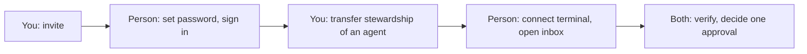

A person is onboarded when they can sign in, see their agent on **My Agent**, have their terminal connected, and have decided one real approval from their own session. Your half takes about five minutes in two short sittings; theirs is in [Getting started as a steward](../steward/getting-started). Do your steps in this order — the connect code they will need is created last, by them, because it expires ten minutes after it is made.

## 1. Create the account

Invite from **Company Settings → Invites** with auto-approve ticked, then send them the link yourself.

1. Open **Company Settings → Invites**.
2. Enter their work email. Role **Member** — reserve **Admin** for people who will run the instance.
3. Tick **auto-approve**. Without it their join request waits in **Company Settings → Access → join requests** until you approve it.
4. **Create invite.** The page shows the link with a **Copy** button, and an invite email goes out if email is configured on this instance.
5. Send the link yourself as well, with a one-line note. Do not rely on the email reaching them.

The link points at the address this instance publishes, `{{instanceUrl}}`, so it opens from wherever that address is reachable. **Invite history** on the same page shows status and expiry; **Revoke** a mistyped address there and create a fresh one. There is no way to create an account without a signed-in admin.

## 2. Give them an agent

Every stewarded agent has exactly one steward, and every person has at most one active agent. You create the agent, then move its stewardship to the person in **Company Settings → Access**. The move is the step people forget: an agent you create is paired with **you** until you transfer it.

1. **Agents → New agent**. Give it a name and a role; `general` is the default and fine to start. Leave the adapter at the instance default.
2. Wait until the person has accepted the invite — they appear under **Company Settings → Access → Humans**. The stewardship panel lists active members only.
3. **Company Settings → Access → Agent stewardship**: select the agent, select the person, **Assign**. Because the agent already has a steward (you), this is a transfer and asks for a reason. Write `onboarding <name>` — it is the audit trail.
4. Check: the **Agents** page shows the agent with a **Stewarded** badge, and its detail page shows **Steward: <name>**.

An agent already showing the amber **Needs a steward** badge — one another agent hired — can be assigned directly; skip step 1. See [Agent kinds and stewardship](./agent-kinds-and-stewardship) for what the badges mean.

By API, for scripting: `POST /api/companies/{companyId}/agent-stewardships` with `{ "agentId", "userId" }`, as an admin.

## 3. Verify it worked

Onboarding is done when every row passes. Row 6 is the one that matters.

| # | Who | Do | Expect |
| --- | --- | --- | --- |
| 1 | Person | `npx agentdash-connect --check` | `Claude configured` and `Status working — <n> tools available` |
| 2 | Person | New Claude Code session; ask "use whoami and tell me who I am" | The agent's name, role, company, `autonomy: stewarded`, `steward:` <their name> |
| 3 | Person | New session in `~/agentdash-inbox` | The hook prints what is waiting, or nothing — no error |
| 4 | Person | Ask "what's waiting on me?" | `inbox_sync` answers as them, even if empty |
| 5 | You | Their **My Agent → Connected machines** | Their machine listed with **inbox** capability, not **read-only** |
| 6 | Both | You create a small approval that lands on them; they say "approve it" | The approval shows **decided by <person>**, channel `bridge_inbox` |

If row 5 says **read-only**, they connected with a pre-0.2 CLI: `npx agentdash-connect --remove`, then reconnect with a fresh code.

## Offboarding

Revoking on the board is immediate and does not need the person's machine. Cleaning the machine is a courtesy, done second.

**A machine, not the person** (lost or replaced laptop): their **My Agent → Connected machines → Disconnect**. Its key stops working at once. On the machine, if it still exists, `npx agentdash-connect --remove`.

**The person is leaving:**

1. Disconnect every machine under **Connected machines**.
2. **Company Settings → Access → Agent stewardship**: transfer their agent to the next steward (reason required) or release it. A released agent shows **Needs a steward** until someone is paired.
3. **Company Settings → Access → Humans → Remove**. The dialog asks who inherits their open tasks.
4. **Company Settings → Invites**: revoke any unaccepted invite for that address.

Do not delete the agent. Its history is the audit trail for what it did under that steward.
