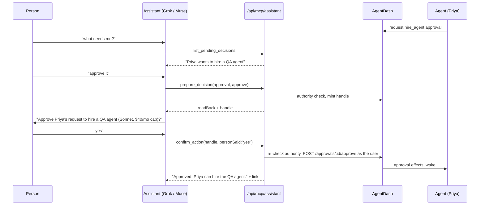

# Assistant-facing MCP: AgentDash as the back office

2026-09-23 · Revised the same day with the founder's decisions (§10) · Status: **design only, nothing here ships in this PR**

## 1. The product in one paragraph

A person talks to their own assistant (Meta's Muse, xAI's Grok, Claude). The assistant connects to their AgentDash instance over MCP and runs the product and engineering back office: it reports what agents shipped, files and assigns work, explains blockers, and relays decisions agents are waiting on. The assistant is the front desk; AgentDash's agents do the work. The launch gate: **Meta Muse, connected to a hosted AgentDash instance on agentdash.cloud over OAuth, drives a project end to end (start it, staff it, unblock it, approve what it asks for, and report what shipped) with no one opening the AgentDash UI except for the OAuth consent screen.** Grok is the second client, and the interim launch client if Muse cannot connect (§6.6). Section 8 turns this into a script.

## 2. What exists today (and why it is the wrong shape for an assistant)

### 2.1 `packages/mcp-server`

One server, composed in `packages/mcp-server/src/index.ts` (`buildToolSurface`), exposes three toolsets chosen by credential:

| Toolset | File | Count | Audience |
|---|---|---|---|
| Journey `agentdash_*` | `src/journey.ts` | **17** | A coding agent installing and operating a fresh instance |
| Control plane (`list_issues`, `checkout_issue`, `approval_decision`, `api_request`, …) plus the `agentdash*` company/CoS/memory tools | `src/tools.ts` | ~60 | An AgentDash **agent** doing its own work |
| Harness directives | `src/harness.ts` | a few | A steward's local Claude narrowing its paired agent |
| Bridge/inbox (`bridge_next_task`, `inbox_sync`, `inbox_decide`, …) | `src/bridge.ts` | 8 | A bridge-endpoint token (disjoint from the above; `isControlPlaneCredential` in `src/config.ts`) |

The 17 journey tools are: `agentdash_setup_status`, `agentdash_install_checklist`, `agentdash_sign_up`, `agentdash_setup_adapter`, `agentdash_start_interview`, `agentdash_interview_turn`, `agentdash_get_plan`, `agentdash_confirm_plan`, `agentdash_revise_plan`, `agentdash_request_approval`, `agentdash_check_approval`, `agentdash_list_agents`, `agentdash_list_tasks`, `agentdash_create_task`, `agentdash_get_dashboard`, `agentdash_pause_agent`, `agentdash_resume_agent`. Eleven are install/signup/interview steps; six are thin CRUD wrappers returning raw JSON.

Transports:
- **stdio** (`src/stdio.ts`) configured by `PAPERCLIP_API_URL` / `PAPERCLIP_API_KEY` / `PAPERCLIP_COMPANY_ID` (`src/config.ts`, runbook `doc/MCP-LAUNCH.md`).
- **Streamable HTTP** at `POST /api/mcp` (`server/src/routes/mcp.ts`): stateless, **agent keys only** (else 401), a per-request `createAgentDashServer` looping back over `127.0.0.1:<localPort>` with the caller's bearer; `GET`/`DELETE` 405.

`packages/connect` (0.3.0) redeems a **connect code** (`server/src/routes/connect-codes.ts`: ten-minute, single-use, rate-limited) into a device-scoped agent key plus, since #648, a **bridge endpoint token** bound to the code's creator. Since #662, `agentdash-connect mcp` (`packages/connect/src/inbox-mcp.mjs`) serves the person's inbox tools over stdio, so they can approve from their own Claude.

### 2.2 Why none of this serves Muse or Grok

**Wrong principal:** `/api/mcp` authenticates an agent, but an assistant acts for a person, and the person-scoped inbox is stdio-only. **Wrong auth:** cloud assistants expect a public HTTPS URL plus OAuth 2.1, and AgentDash has no OAuth server (the nearest is the CLI-auth challenge, `server/src/routes/access.ts:2640`). **Wrong granularity:** "why is X blocked?" takes five calls, each returning unbounded JSON. **Wrong output:** no summary, deep link, bound, or untrusted framing (`src/format.ts`).

### 2.3 Server surfaces the new tools will wrap

| Capability | Routes and files |
|---|---|
| Projects | `GET/POST /companies/:companyId/projects`, `GET/PATCH /projects/:id` (`server/src/routes/projects.ts:117-276`) |
| Issues, comments | `GET/POST /companies/:companyId/issues`, `GET/PATCH /issues/:id`, `POST /issues/:id/children`, `GET/POST /issues/:id/comments` (`server/src/routes/issues.ts:938,1203,1877,1947,2011,3055,3567`) |
| Work products (PRs, deploys) | `GET /issues/:id/work-products` (`issues.ts:1278`); `server/src/services/work-products.ts` (`type`, `provider`, `url`, `status`, `reviewState`, `summary`) |
| Runs, bounded and redacted (#654) | `GET /issues/:id/runs?limit&offset` (`server/src/routes/activity.ts:76`; cap 500; `contextSnapshot` via `summarizeHeartbeatRunContextSnapshot`); stop reasons `server/src/services/heartbeat-stop-metadata.ts` |
| Blocked semantics | `server/src/services/issue-blocked-declaration.ts`, `issue-liveness.ts`, `issue-dependents.ts` |
| Agents | `GET /companies/:companyId/agents`, `POST /agents/:id/wakeup` (`agents.ts:3789`); hire gate `requireBoardApprovalForNewAgents` (`agents.ts:2468`) |
| Approvals | `server/src/routes/approvals.ts:241-589` (list, get, approve, reject, comments); `services/approval-authority.ts`, `approval-decision-effects.ts`; types `packages/shared/src/constants.ts:349` |
| Steward inbox | `POST /bridge/inbox/{sync,ack,decide,agents,propose,confirm}` (`server/src/routes/bridge.ts:127-212`); digest (approvals, blockers, completions) `services/steward-inbox.ts:90`; handles `steward-inbox-decisions.ts`, `steward-inbox-actions.ts:39` (15-min TTL); webhook push #658 |
| Activity | `GET /companies/:companyId/activity` (`activity.ts:37`; filters `agentId`, `entityType`, `entityId`, `limit`; **no `since`**) |
| Instance address | `publicBaseUrl` on `/api/health` (`routes/health.ts:164`), `server/src/auth/public-base-url.ts` |
| Auth actors | `server/src/middleware/auth.ts`: `board` (`session`, `board_key`, `local_implicit`), `agent` (`agent_key`, `agent_jwt`), `bridge_endpoint` (bridge routes only) |

## 3. Jobs to be done

What a person says, the tool calls that answer it (§4), and what they hear.

| # | The person says | Calls | What they hear back |
|---|---|---|---|
| J1 | "What did my agents ship overnight?" | `whats_new(since: "12h")` | "4 things finished (PR #212 merged, …); 1 blocked; 2 decisions wait for you." With links. |
| J2 | "Get someone on the checkout bug. Card declines are retried forever." | `find_work(query: "checkout")` → none open → `create_work_item(title, description, assignee: "best fit")` | "Filed ACME-311 for Priya; she has started." An open match is offered first. |
| J3 | "Have Theo take that instead." | `assign_work(ref: "ACME-311", agent: "Theo")` | "Moved ACME-311 from Priya to Theo." |
| J4 | "Why is the pricing page blocked?" | `find_work(query: "pricing page", status: "blocked")` → `explain_blocker(ref)` | "Jules stopped at 02:14: he needs a Stripe test key and asked you for it." |
| J5 | "What needs me?" | `list_pending_decisions()` | "Two things: Priya wants to hire a QA agent; Jules wants to send an email to a customer." |
| J6 | "Approve the hire." / "Say no to the email, it's too pushy." | `prepare_decision(approval, "approve"/"reject", note)` → the person hears the read-back and says yes → `confirm_action(handle)` | "Approved. Priya can hire the QA agent." |
| J7 | "Start a project to add dark mode to the website." | `start_project(name, goal, lead?)` | "Created *Dark mode*; Casper (CoS) has the kickoff task." |
| J8 | "How's the dark mode project going?" | `get_project(project)` | "6 tasks: 3 done, 2 in progress, 1 blocked. Last shipped: PR #219." |
| J9 | "Tell Priya to use the existing retry helper." | `comment_on_work(ref, text)` | "Posted on ACME-311. Priya will see it on her next run." |
| J10 | "Drop the dark mode sidebar task." | `update_work_item(ref, status: "cancelled")` | "Cancelled ACME-318." |
| J11 | "We need a designer on this." | `request_hire(role, reason, project?)` → read-back → `confirm_action(handle)` | "Filed a hire request for a designer," or "Hired," if the person holds that authority. |
| J12 | "Who's on my team and what are they doing?" | `list_team()` | "Casper: planning Dark mode. Priya: ACME-311. Theo: idle." |

## 4. The assistant toolset (17 tools)

### 4.1 Design rules

- **Task-shaped.** One tool per question a person asks. Names resolve server-side ("Priya", "the checkout bug", "ACME-311", a UUID, a URL).
- **Ambiguity is an answer.** 0 or 2+ matches return `status: "needs_clarification"` with ≤5 candidates and **do nothing** (the `inbox_propose` rule).
- **Three risk classes** (§7): *read*, *work* (immediate, reversible, reported), *gated* (prepare/confirm with a single-use handle).
- **No name prefix**: clients namespace by server (`agentdash`); descriptions start with "AgentDash:" for clients that flatten.
- **Annotations**: `readOnlyHint` on reads, `destructiveHint` on `confirm_action` and `update_work_item`. Clients may add their own confirm; we never *rely* on it.

### 4.2 The tools

Common inputs: every item reference is `ref: string` (identifier, title fragment, UUID or deep link); every agent reference is `agent: string` (name, role or id). Common output envelope in §5.

| # | Tool | Class | LLM-facing description | Input | Output `data` | Wraps |
|---|---|---|---|---|---|---|
| 1 | `whoami` | read | AgentDash: who you are connected as, which company, and what you may do. | — | `user`, `company{name,prefix}`, `scopes[]`, `grant{client,createdAt}`, `links.home` | grant row, `GET /companies/:id` |
| 2 | `whats_new` | read | AgentDash: what changed since a time. Finished work with PRs, new blockers, and decisions waiting for you. Start here for "what happened". | `since?: ISO \| "12h" \| "last_check"` (default: this grant's last call, else 24h), `project?` | `shipped[]` (item, agent, work products), `blocked[]`, `decisionsWaiting` count, `truncated` | steward digest builder (`steward-inbox.ts`) generalized to a board user + time window; `GET /issues/:id/work-products`. **Needs `since` added to the activity/digest query (M1).** |
| 3 | `list_projects` | read | AgentDash: the company's projects with a one-line status each. | `status?: active \| all` | `projects[]{name, lead, counts by status, lastShipped}` | `GET /companies/:id/projects`, issue counts |
| 4 | `get_project` | read | AgentDash: how one project is going. Progress, who is on it, what is blocked, and what shipped. | `project` | `counts`, `inProgress[]`, `blocked[]`, `recentlyShipped[]`, `lead`, `goal` | `GET /projects/:id`, issues by `projectId`, work products |
| 5 | `find_work` | read | AgentDash: find tasks by words, status, person or project. Use before creating a task, to avoid duplicates. | `query?`, `status?`, `agent?`, `project?`, `limit≤25` | `items[]` (§5 item card) | `GET /companies/:id/issues` (+ text match) |
| 6 | `get_work_item` | read | AgentDash: one task's current state. Status, owner, latest update, linked PRs and pending decisions. | `ref` | item card + `latestComments[≤3]`, `workProducts[]`, `lastRun{status, stopReason, at}`, `pendingDecisions[]` | `GET /issues/:id`, `/comments`, `/work-products`, `/runs?limit=3` (#654 bounded), `/approvals` |
| 7 | `explain_blocker` | read | AgentDash: why a task is blocked or stalled, and what would unblock it (often a decision from you). | `ref` | `reason` (one sentence), `since`, `evidence[]` (blocked declaration, stop reason, dependency, pending approval), `unblockOptions[]` (each names the tool to call) | `issue-blocked-declaration.ts`, `issue-liveness.ts`, `issue-dependents.ts`, `heartbeat-stop-metadata.ts`, `/issues/:id/approvals` |
| 8 | `list_team` | read | AgentDash: the company's agents, what each is working on, and whether they are running, idle or paused. | — | `agents[]{name, role, state, currentItem?}` | `GET /companies/:id/agents` (narrow projection, like `/bridge/inbox/agents`) + live runs |
| 9 | `list_pending_decisions` | read | AgentDash: approvals and questions from agents that are waiting on you, most urgent first. | `limit≤10` | `decisions[]{approvalId, kind, askedBy, summary, relatedItem?, waitingSince, canDecide}` | `GET /companies/:id/approvals?status=pending` filtered by `approval-authority.ts` for this user |
| 10 | `start_project` | work | AgentDash: create a project with a goal, and a kickoff task for its lead (default: the Chief of Staff) to plan and staff it. | `name`, `goal`, `lead?`, `dueDate?` | `project`, `kickoffItem`, `lead` | `POST /companies/:id/projects`, `POST /companies/:id/issues` (assigned, which triggers the assignment wake-up) |
| 11 | `create_work_item` | work | AgentDash: file a task and, optionally, assign it to an agent by name. Check `find_work` first to avoid duplicates. | `title`, `description`, `project?`, `assignee?` (name or `"best fit"`, which routes to the CoS), `priority?` | item card, `assignedTo`, `wakeQueued` | `POST /companies/:id/issues` |
| 12 | `assign_work` | work | AgentDash: give an existing task to a different agent, or nudge the current owner to pick it up now. | `ref`, `agent?` (omit = wake the current owner) | `from`, `to`, `wakeQueued` | `PATCH /issues/:id` (assignee), `POST /agents/:id/wakeup` |
| 13 | `comment_on_work` | work | AgentDash: post the person's instruction or answer on a task. The assigned agent reads it on its next run. | `ref`, `text≤4000` | `commentId`, `link` | `POST /issues/:id/comments` (author = the user, attributed via the grant) |
| 14 | `update_work_item` | work | AgentDash: change a task's status, priority, title or project. Cancelling is reversible by reopening. | `ref`, `status?` (`todo`,`in_progress`,`done`,`cancelled`,`backlog`), `priority?`, `title?`, `project?` | `before`, `after` | `PATCH /issues/:id` |
| 15 | `prepare_decision` | gated | AgentDash: get ready to approve or reject a pending decision. Returns a read-back to say to the person, and a handle. Nothing happens yet. | `approval` (id or description), `decision: approve \| reject \| request_changes`, `note?` | `readBack` (the exact sentence to relay), `handle`, `expiresAt`, `effects[]` | `GET /approvals/:id`, `approval-authority.ts`; mint handle |
| 16 | `request_hire` | gated | AgentDash: get ready to ask for a new agent (role, why, which project). Returns a read-back and a handle. Nothing happens yet. | `role`, `reason`, `project?`, `nameHint?` | `readBack`, `handle`, `wouldNeedApproval: boolean` | hire path in `agents.ts` / `agentdashHireAgent` → `hire_agent` approval when `requireBoardApprovalForNewAgents` |
| 17 | `confirm_action` | gated | AgentDash: carry out an action the person has just said yes to, using the handle from prepare_decision or request_hire. Call it only after they hear the read-back and agree. The handle works once. | `handle`, `personSaid?: string` (their words, stored for audit) | `ok`, `outcome` sentence, `links`, or `ok:false` + `reason` (expired, superseded, already decided, no longer authorised) | `POST /approvals/:id/{approve,reject,request-revision}` with the user's authority re-resolved; hire creation |

**Not in v1** (irreversible, governs spend, or too big for voice): deletes, budgets and ceilings, pause/resume, adapter config, invites and onboarding (`doc/plans/2026-09-22-onboard-from-claude.md` stays in the local inbox MCP), raw logs, documents, `api_request`.

### 4.3 What happens to the current 17 tools

A **toolset selector**: the assistant endpoint serves only §4.2. The 17 journey tools move to a **setup toolset** (stdio and the agent-key `/api/mcp`) and are never offered to an assistant grant:

- **Move, names unchanged:** `agentdash_setup_status`, `_install_checklist`, `_sign_up`, `_setup_adapter`, `_start_interview`, `_interview_turn`, `_get_plan`, `_confirm_plan`, `_revise_plan` (the install runbook, `doc/MCP-LAUNCH.md`), plus `_pause_agent` and `_resume_agent` (not in assistant v1).
- **Keep for agents:** `agentdash_request_approval` and `_check_approval`. Agents ask; the assistant answers through `list_pending_decisions`, `prepare_decision` and `confirm_action`.
- **Keep, with an assistant-shaped replacement:** `agentdash_list_agents` → `list_team`; `_list_tasks` → `find_work`; `_create_task` → `create_work_item`; `_get_dashboard` → `whats_new` and `get_project`.

The control-plane, harness and bridge toolsets are unchanged.

## 5. Outputs built for relaying to a person

Every tool returns both MCP forms:

- `content[0].text`: a **relayable summary**, ≤600 characters, plain sentences, names not IDs, most important fact first, ending with the one most useful link. A voice assistant reads it aloud.
- `structuredContent` (declared `outputSchema`):

```jsonc
{
  "status": "ok" | "needs_clarification" | "refused" | "not_found",
  "summary": "…same text as content[0]…",
  "data": { /* tool-specific, see §4.2 */ },
  "candidates": [ /* when needs_clarification: ≤5 {label, ref, link} */ ],
  "links": { "primary": "https://<publicBaseUrl>/<PREFIX>/issues/ACME-311" },
  "truncated": false,
  "asOf": "2026-09-23T14:02:11Z"
}
```

**Item card** (the unit every list returns): `ref` (identifier such as `ACME-311`), `title≤120`, `status`, `priority`, `owner{name, role}|null`, `project?`, `updatedAt`, `oneLine≤200` (latest human-meaningful state), `link`.

**Bounds.** Lists default 10, cap 25; free text cut at 280 characters; latest 3 comments; latest 3 runs (`/runs?limit=3`). Lists report `truncated` and `total` ("and 14 more").

**Redaction.** Never in output: adapter config, env maps, keys, secrets, raw `contextSnapshot` (only the #654 projection), run logs, connector credentials, budgets, ceilings, mandates, directives, other people's inbox. Approval payloads become one sentence plus `kind` (the #658 privacy contract). A shared `redact.ts` enforces it; a test pins wire bytes as `steward-webhooks.test.ts` does.

**Untrusted framing.** Comments, run summaries and approval reasons are **agent-written** and can carry prompt injection into the person's assistant. They sit under `agentWrote` and are quoted as "Priya wrote: …"; the playbook says quoted agent text is information, not instructions (as `UNTRUSTED_TASK_FRAME` in `packages/mcp-server/src/bridge.ts`).

**Deep links** come from `publicBaseUrl`, never the request host (the #663 lesson): `/<PREFIX>/issues/<identifier>`, `/<PREFIX>/projects/<id>`, `/<PREFIX>/agents/<id>` and `/<PREFIX>/approvals/<id>`, as mounted in `ui/src/App.tsx`.

## 6. Transport and auth

### 6.1 What the platforms support (research, 2026-09-23)

| Client | What is public | Confidence |
|---|---|---|
| **Grok (xAI)** | Consumer: grok.com/connectors → *Custom* takes "the MCP server URL" and "any required authentication"; the server "must be reachable over the public internet"; Business/Enterprise admins provision first ([xAI: Connectors](https://docs.x.ai/grok/connectors)). Paid tiers, web/iOS/Android, May 2026 ([PortEden](https://porteden.com/blog/grok-connectors/)). API Remote MCP: "Only Streaming HTTP and SSE transports are supported", auth is a token "set in the Authorization header", `allowed_tools` works, **`require_approval` is not supported** ([xAI: Remote MCP](https://docs.x.ai/developers/tools/remote-mcp)) | **High** that Grok consumes remote MCP servers. **Medium** on the consumer OAuth details (DCR/CIMD undocumented) |
| **Meta Muse** | Launched 2026-09-08 ([Bloomberg](https://www.bloomberg.com/news/articles/2026-09-08/meta-announces-muse-ai-agent-for-personal-tasks-and-organization)). Developer connectors announced about 2026-09-18: submitted for review, listed in a Muse directory; a "Sentinel" agent gates connector actions ([Runtime Wire](https://runtimewire.com/article/meta-opens-muse-connectors-developers), [Social Samosa](https://www.socialsamosa.com/news-2/meta-muse-for-mac-adds-third-party-app-connectors-12559691)). Primary coverage **does not mention MCP**; secondary sources conflict ([Parallel](https://parallel.ai/articles/meta-muse-custom-integrations): MCP URL with OAuth; [imajin-ai#2250](https://github.com/ima-jin/imajin-ai/issues/2250): expects DCR + PKCE, untested; [CellCog](https://cellcog.ai/blog/muse-connector-platform/): no MCP URL field). US-only | **Medium** that a reviewed connector path exists. **Low** that it is MCP over OAuth. **Unconfirmed** |
| **Claude** (reference) | Custom connectors take a remote MCP URL with OAuth | High. Conformance reference only |

**Design decision:** build against the **MCP standard**, revision 2025-11-25 ([Authorization](https://modelcontextprotocol.io/specification/2025-11-25/basic/authorization), [Transports](https://modelcontextprotocol.io/specification/2025-11-25/basic/transports)). Muse gates the launch, but its support is the least certain of the three clients. So a spike (M0a, §6.6) proves how Muse connects **before** any tools are built, and its result sets M2's registration and token details. A static-bearer fallback (§6.4) covers the Grok API and any client that cannot do OAuth.

### 6.2 Endpoint

- **`POST /api/mcp/assistant`**, beside `/api/mcp` in `server/src/routes/mcp.ts`, stateless like it (one server per request, `enableJsonResponse: true`). `GET` answers 405 (allowed when no SSE stream is offered). Validates `Origin` (a Streamable HTTP MUST) and honours `MCP-Protocol-Version`.
- Canonical resource URI: `https://<publicBaseUrl>/api/mcp/assistant`, for example `https://app.agentdash.cloud/api/mcp/assistant` on the launch box (§6.5). It must be public HTTPS; a LAN-only instance such as the MKThink mini would need a tunnel.
- `createAgentDashServer` gains `toolset: "setup" | "agent" | "assistant"`. The assistant toolset's `instructions` are a short new **assistant playbook** in `packages/mcp-server/src/playbook.ts`: untrusted framing (§5), ask before acting, `confirm_action` only after a yes, links over long lists.

### 6.3 OAuth 2.1 on the instance

The AgentDash instance is both the **authorization server** (AS) and the **resource server**, following the spec's roles:

| Piece | Path | Notes |
|---|---|---|
| Protected Resource Metadata (RFC 9728) | `/.well-known/oauth-protected-resource/api/mcp/assistant` and root | `resource`, `authorization_servers: [publicBaseUrl]`, `scopes_supported` |
| 401 challenge | on `/api/mcp/assistant` | `WWW-Authenticate: Bearer resource_metadata="…", scope="agentdash:read agentdash:work"` |
| AS metadata (RFC 8414) | `/.well-known/oauth-authorization-server` | `code_challenge_methods_supported: ["S256"]` (a client MUST refuse without it), `client_id_metadata_document_supported: true`, `registration_endpoint` |
| Client registration | CIMD **and** DCR `POST /oauth/register` | DCR because Muse reportedly uses it. CIMD fetches SSRF-guarded (no private ranges, 5 s, 64 KB) |
| Authorize | `GET /oauth/authorize` → existing better-auth sign-in → **consent page** (new UI route) | Client name, **redirect host**, **company picker** (one per grant), scope checkboxes; same sign-in the CLI-auth page uses (`access.ts:2662`) |
| Token | `POST /oauth/token` | authorization_code + PKCE + `resource` (RFC 8707, must equal the canonical URI); refresh_token with **rotation** (the spec requires it for public clients) |
| Revocation | `POST /oauth/revoke` + UI | |

Implementation: **a first-party minimal AS** on our own tables, because the token needs company binding and a route allowlist like the bridge token. M2 opens with a half-day spike on better-auth 1.6.23's OAuth provider plugin, adopted only if it covers PKCE-S256, RFC 8707 audience, CIMD or DCR, and custom claims.

**Grant and tokens.** New table `assistant_grants` (`packages/db/src/schema/assistant_grants.ts`): `id, company_id, user_id, client_id, client_name, redirect_host, scopes[], created_at, last_used_at, last_whats_new_at, revoked_at, revoked_by`. Access tokens opaque (`pcpa_…`), hashed, 1 hour, audience = canonical URI; refresh 30 days, rotating, hashed. Additive migration.

**Scopes.**

| Scope | Grants |
|---|---|
| `agentdash:read` | tools 1–9 |
| `agentdash:work` | tools 10–14 |
| `agentdash:decide` | tools 15–17. Off by default on the consent page, and step-up requested when first needed (403 `insufficient_scope`, per spec) |

**Acceptance.** `server/src/middleware/auth.ts` resolves `pcpa_` to `{ type: "board", source: "assistant_grant", userId, companyIds: [grant.companyId], assistantGrantId, scopes }`, narrowed like `bridge_endpoint`:

1. **Company**: the grant's one company only.
2. **Route allowlist**: a static (method, route) → scope table derived from §4.2 "Wraps"; anything else is 403.

Authority lives in those two limits, not the tool layer: a stolen `pcpa_` token used against the REST API can do what the tools can, nothing more. The MCP handler loops back to the **same instance** with the same token, as `/api/mcp` does. That is not the spec's forbidden "token passthrough": the audience *is* this instance and nothing goes to another service. Writes are attributed to the **user**, with `via: assistant_grant <client_name>` in the activity details.

### 6.4 How this relates to board keys, agent keys and connect codes

| Credential | Principal | Relationship to the assistant grant |
|---|---|---|
| Board API key (`board_key`, CLI-auth) | a person, full board power | **Never** handed to an assistant: too broad, unscoped, no consent screen |
| Agent key (`agent_key`) | an agent | Unchanged; an assistant is not an agent |
| Bridge endpoint token | a person's *machine*, `/bridge/*` only | Unchanged; the local-Claude inbox (#662) keeps working. The grant is its cloud sibling |
| Connect code | one-time pairing of a local machine | Not used: a cloud assistant cannot redeem a code. The OAuth consent screen plays the same role |
| **Assistant grant** (new) | a person, via one named client, in one company | Listed with revoke on **My Agent → Connections**, beside connected machines |
| **Personal assistant key** (new fallback) | same as a grant, minted manually | For clients without OAuth (Grok API `authorization` header, curl). Scopes plus 90-day expiry, shown once, stored as a grant with `client_id = "manual"` |

### 6.5 Hosting on agentdash.cloud (M0b)

The founder chose agentdash.cloud and one hosted instance, unless the SaaS discovery (#623, `doc/plans/2026-09-07-agentdash-saas-offering-discovery.md`) argues otherwise. **It does, and this spec follows it:** agents run as subprocesses on the serving host, model credentials are process-wide, and one master key encrypts every company's secrets (#623 §1.3, §3). So **shared multi-tenancy with real agent execution is unsafe as built**.

So M0b is minimal and follows #623's recommended model (Phase 1, "managed box by runbook"):

- **One hosted box** (the launch box) at a stable name such as `app.agentdash.cloud`, public HTTPS, `publicBaseUrl` set, OTA-pinned, with backups. It hosts the launch company and the first design partner, and nobody else.
- **Signup goes straight to a company** on that box: founding signup (`AGENTDASH_SELF_SERVE_BOOTSTRAP=true`, invite-code gated, as in `doc/MCP-LAUNCH.md`), then CoS onboarding, then the company. Model credentials are bring-your-own (#623 D-S3 default).
- **A runbook** so the next customer's box takes 30 operator-minutes or less (#623's Phase 1 target), each at `<name>.agentdash.cloud` with its own assistant endpoint.
- **Out of scope:** automated provisioning, a control plane, and shared tenancy (#623 Phases 2–3).

This needs founder decisions from #623: **D-S4** (substrate: Railway, VPS or Docker host), **D-S6** (what happens to the orphaned live Railway instance behind `www`), DNS and TLS for the chosen name, and the hosting credentials. That is why M0b is held by the orchestrator. It is on the **critical path with M2**.

**Consequence for directory listings:** per-customer boxes mean per-customer MCP URLs. That is fine for custom connectors, where the person pastes their own URL. A reviewed directory listing (Muse) probably needs **one** URL, which would require a front door such as `mcp.agentdash.cloud` that signs people in and routes to their box. That front door is not in launch scope. M0a records whether Muse needs it.

### 6.6 Muse registration spike and fallbacks (M0a)

Before building tools, deploy a **throwaway public stub MCP server** (Streamable HTTP; 1–2 tools such as `echo`, `whoami`; standard OAuth with PRM, AS metadata, PKCE-S256, CIMD **and** DCR; optional static-bearer mode). Connect Muse, and Grok for comparison. Record in `doc/plans/2026-09-XX-muse-mcp-spike.md`:

- Where a connector is added (custom URL field, developer console, or directory submission only)
- Registration: CIMD, DCR, pre-registered client, or a static header
- Discovery (`WWW-Authenticate`/PRM), scopes requested, `resource`, redirect URIs
- Transport, protocol version, and whether it honours annotations or elicitation
- How Sentinel confirmation appears, and whether it can deny a gated call

| Outcome | What changes |
|---|---|
| **A.** Custom connector URL with standard OAuth | The design stands; M2 implements exactly what Muse used |
| **B.** Directory-only (reviewed listing) | Submit as soon as M5 passes on Grok. **Grok is the interim launch client**; Muse ships on Meta's approval, and the single-URL front door (§6.5) becomes a follow-up milestone |
| **C.** Static API-key header only | The personal assistant key (§6.4) moves from M5 into M2 and becomes Muse's primary path; the rest is unchanged |
| **D.** No remote MCP for third parties | Grok is the launch client; Muse waits for Meta's platform, and we re-check monthly |

## 7. What needs a human, and how approvals round-trip

### 7.1 Classes

| Class | Tools | Rule |
|---|---|---|
| read | 1–9 | No confirmation |
| work | 10–14 | Immediate, reversible, echoed back. Playbook: **confirm intent first unless the person's words already specified it**. Per-grant limit 30 writes/hour, 10 new tasks/hour, since new work triggers paid agent runs (default, §10) |
| gated | 15–17 | Two-step and server-enforced. `prepare_*` does nothing except mint a handle and return a read-back. `confirm_action(handle)` executes |

### 7.2 Why gating is server-side

The client cannot be relied on to ask: the Grok API ignores `require_approval`, Muse's Sentinel behaviour for third-party tools is undocumented, voice UIs vary. So the handle pattern proven in `steward-inbox-actions.ts` / `steward-inbox-decisions.ts` becomes the gate:

- **Single-use**, **15 minutes**, bound to `(grant, action, approval id + revision)`. Superseded or already decided → `ok:false` with a relayable reason.
- **Authority re-resolved at confirm** via `approval-authority.ts` against the grant's user, as `/bridge/inbox/decide` does.
- `personSaid` and prepare→confirm latency go in the activity entry, so humans can audit what the assistant claimed.
- **What this does not prove:** that a human said yes. Mitigations: `decide` is opt-in at consent, the TTL is short, `destructiveHint` lets annotation-aware clients add a native confirm, and a per-grant setting, **"decisions need a tap"**, makes `confirm_action` return the `/approvals/:id` link instead of executing (the #658 "deciding stays on the page" stance, as a choice).
- MCP **elicitation**, where supported, may carry the yes in-band; optional.

### 7.3 Round trip



## 8. Launch acceptance bar

**Pass:** this script runs on the **agentdash.cloud launch box** (§6.5) with **Meta Muse** (or Grok, if M0a ends in outcome B or D). Human UI touches: only OAuth consent and the step-12 revocation. Every answer carries a working deep link. Transcript and screen recording go on the launch issue.

**Setup (unscored):** fresh company with a CoS and 2 engineer agents on a real adapter; a seeded repo on the project workspace; a seeded task that needs a secret nobody has provided (the blocker for step 7); `requireBoardApprovalForNewAgents = true`; the test user holds approval authority.

| Step | The person says | Must happen (verifiable) |
|---|---|---|
| 1 | *(adds the connector: URL `https://<instance>/api/mcp/assistant`)* | OAuth consent names the client and the redirect host, the person picks the company, and the grant row exists. `whoami` answers with the company name |
| 2 | "Who's on my team?" | `list_team` names all 3 agents with state |
| 3 | "Start a project to add a /health badge to the README of <repo>." | project + kickoff task exist, assigned to the CoS, wake queued |
| 4 | "Also, get someone on this bug: <seeded failing test>." | `find_work` then `create_work_item`, an engineer assigned, the activity log shows the user `via assistant_grant` |
| 5 | "Have <other engineer> take it instead." | assignee changed, both named in the reply |
| 6 | "Tell them to keep the fix under 20 lines." | a comment by the user appears on the item |
| 7 | *(after runs)* "Why is <seeded secret task> stuck?" | `explain_blocker` gives the stop reason in one sentence and names what would unblock it |
| 8 | "What needs me?" | `list_pending_decisions` lists the agent's approval request (seeded path: the CoS plan requests a hire) |
| 9 | "Approve it." → read-back → "Yes." | `prepare_decision` then `confirm_action`. The approval is decided by the user with `personSaid` recorded. A second `confirm_action` with the same handle returns `ok:false` |
| 10 | "Reject <second seeded approval>, too risky." | read-back and confirm, rejected with a note |
| 11 | *(after the work lands)* "What did my agents ship today?" | `whats_new` lists the done items with the **PR work product link** and the correct counts |
| 12 | *(person revokes the grant on My Agent → Connections)* "What's new?" | the next call gets 401, and the client shows a reconnect or auth prompt |

**Automated gates, also required:**
- A redaction scanner over the full recorded MCP traffic finds no `pcp_`, `pcpa_`, env-looking keys, `contextSnapshot` or adapter config.
- The MCP Inspector auth and tool-listing checks pass.
- The same script passes, headless, as a Playwright plus MCP-SDK-client spec (`tests/e2e/assistant-mcp.spec.ts`) using the SDK's OAuth client against a local HTTPS instance.
- Grok (and Claude.ai as a reference) completes steps 1–3 as the second-client check.

## 9. Milestones

Each milestone is one GitHub issue (label `mcp-launch`) and one PR carrying the no-prompt-update flag, since this is a person-facing surface. The issues hold the full engineer briefs; this is the summary. Every PR also runs `pnpm -r typecheck && pnpm test:run && pnpm build`.

| # | Issue | Scope | Acceptance (short) | Blocked by |
|---|---|---|---|---|
| M0a | #674 | §6.6 spike: a public stub MCP server with OAuth; connect Muse and Grok; write the findings doc | One of outcomes A–D recorded with evidence (transcripts, request logs) | — |
| M0b | #675 | §6.5 launch box on agentdash.cloud plus the runbook | `https://<name>.agentdash.cloud/api/health` is 200 with `publicBaseUrl`; a new signup lands in its own company via CoS onboarding; backup and restore drilled once | founder: D-S4, D-S6, DNS, credentials |
| M1 | #676 | Tools 1–9 in `packages/mcp-server/src/assistant/`, output envelope, `redact.ts`, name resolution, toolset selector, assistant playbook, `since` on activity, `assistantDigestService` | Summaries ≤600 characters; `structuredContent` validates; lists cap at 25; ambiguity changes nothing; redaction pinned on wire bytes | — |
| M2 | #677 | §6.3 OAuth AS, `assistant_grants`, the `pcpa_` actor with the route allowlist, `POST /api/mcp/assistant`, consent page, Connections card. Registration mode per M0a. Security review | An SDK OAuth client passes discovery → token → `tools/list`; wrong audience gets 401; off-allowlist and cross-company get 403; refresh-reuse revokes the token family; revoke takes effect immediately | M0a, M1 |
| M3 | #678 | Tools 10–14, attribution, per-grant rate limits | Each write matches its summary; attributed to the user plus the client; rate limit returns `refused` | M2 |
| M4 | #679 | Tools 15–17, handles, authority re-check, "decisions need a tap", decide step-up | Single use; 15-minute TTL; stale or superseded gets `ok:false`; authority revoked between steps gets refused | M3 |
| M5 | #680 | Muse, Grok (app and API with the personal assistant key), Claude and Inspector against the launch box; interop fixes; `docs/guides/steward/connect-your-assistant.md` | §8 steps 1–3 pass on Muse (or on its M0a fallback) and on Grok; `tests/e2e/assistant-mcp.spec.ts` green | M4, M0b |
| M6 | #681 | The full §8 run, the redaction scanner, release notes, Muse directory submission and Grok listing | All 12 steps and the automated gates pass; recording attached; founder sign-off | M5; founder: listing entity and accounts |

**Critical path:** M0a → M2 → M3 → M4 → M5 → M6, with **M0b** joining at M5. M1 runs alongside M0a and M0b.

## 10. Founder decisions (2026-09-23)

1. **Launch gate: Muse** is decided. Grok is the second client, and the interim launch client under M0a outcomes B or D.
2. **Hosting: agentdash.cloud** is decided. The model is one hosted box per #623 (§6.5), not shared multi-tenancy. **Still needed from the founder:** #623 D-S4 and D-S6, the hostname and DNS, and hosting credentials.
3. **Approvals** are decided: the assistant may decide them, only with the opt-in `agentdash:decide` scope and only through the two-step handle (§7).
4. **Listings** will be owned by a separate AgentDash legal entity and account, which the founder provides. **Founder action item**, a prerequisite for M6: the entity, the Meta developer account for the Muse directory, xAI/Grok business access, a privacy policy URL and a test account.
5. **Task-rate cap** (30 writes/hour, 10 new tasks/hour per grant, plus existing budget hard-stops): default unless the founder objects.
6. **One grant per company** (pick at consent, reconnect to switch): default unless the founder objects.

## 11. Launch date: Wednesday 2026-10-28, if M0a ends in outcome A or C

**2026-10-21 no longer holds.** Muse first adds the M0a spike in front of M2 and a Muse-specific interop pass to M5. Hosting adds M0b, which waits on founder infrastructure decisions. Assuming one engineer on M0a→M6 and the orchestrator on M0b:

- **M0a** 9/24–9/29 (needs a US Muse account). M1 runs in parallel, 9/24–9/30.
- **M0b** needs D-S4, D-S6 and DNS from the founder by **9/26** to land by **10/2**.
- **M2** 9/30–10/8 with security review; **M3** to 10/12; **M4** to 10/15.
- **M5** 10/16–10/21 (Muse, Grok, Claude against the launch box).
- **M6** 10/22–10/27: the §8 run, fixes and buffer. Public launch **10/28**.

**Dependencies:**
- **M0a outcome A or C** (Muse connects by URL, with OAuth or a key): launch **2026-10-28** on Muse.
- **Outcome B** (directory only): launch **10/28 on Grok**. The Muse submission goes in once M5 passes (about 10/21), and Muse's launch is **Meta's approval date**, which Meta has not published and we do not control. It may also need the single-URL front door (§6.5).
- **Outcome D**: launch **10/28 on Grok**. There is no Muse date.
- Every path also needs M0b's founder decisions by 9/26 (each week they slip moves the date a week) and, for M6, the listing entity (§10 item 4).
