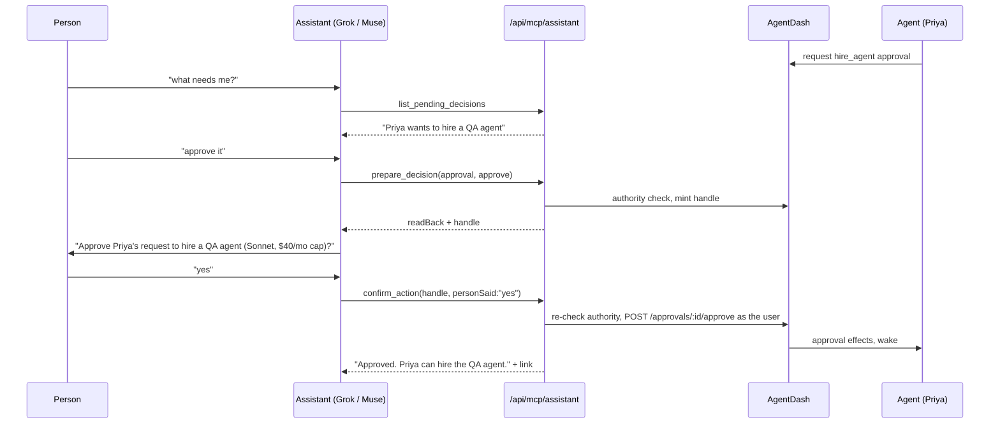

# Assistant-facing MCP: AgentDash as the back office

2026-09-23 · Draft for founder review · Status: **design only, nothing here ships in this PR**

## 1. The product in one paragraph

A person talks to their own assistant (Meta's Muse, xAI's Grok, Claude). The assistant connects to their AgentDash instance over MCP and runs the product and engineering back office: it reports what agents shipped, files and assigns work, explains blockers, and relays decisions agents are waiting on. The assistant is the front desk; AgentDash's agents do the work. The launch gate: **One real assistant client, connected to a real public AgentDash instance over OAuth, drives a project end to end (start it, staff it, unblock it, approve what it asks for, and report what shipped) with no one opening the AgentDash UI except for the OAuth consent screen.** Section 8 turns that sentence into a script.

## 2. What exists today (and why it is the wrong shape for an assistant)

### 2.1 `packages/mcp-server`

One server, composed in `packages/mcp-server/src/index.ts` (`buildToolSurface`), exposes three toolsets chosen by credential:

| Toolset | File | Count | Audience |
|---|---|---|---|
| Journey `agentdash_*` | `src/journey.ts` | **17** | A coding agent installing and operating a fresh instance |
| Control plane (`list_issues`, `checkout_issue`, `approval_decision`, `api_request`, …) plus the `agentdash*` company/CoS/memory tools | `src/tools.ts` | ~60 | An AgentDash **agent** doing its own work |
| Harness directives | `src/harness.ts` | a few | A steward's local Claude narrowing its paired agent |
| Bridge/inbox (`bridge_next_task`, `inbox_sync`, `inbox_decide`, …) | `src/bridge.ts` | 8 | A bridge-endpoint token (disjoint from the above; `isControlPlaneCredential` in `src/config.ts`) |

The 17 journey tools are: `agentdash_setup_status`, `agentdash_install_checklist`, `agentdash_sign_up`, `agentdash_setup_adapter`, `agentdash_start_interview`, `agentdash_interview_turn`, `agentdash_get_plan`, `agentdash_confirm_plan`, `agentdash_revise_plan`, `agentdash_request_approval`, `agentdash_check_approval`, `agentdash_list_agents`, `agentdash_list_tasks`, `agentdash_create_task`, `agentdash_get_dashboard`, `agentdash_pause_agent`, `agentdash_resume_agent`. Eleven are install/signup/interview steps; six are thin CRUD wrappers returning raw JSON.

Transports:
- **stdio** (`src/stdio.ts`) configured by `PAPERCLIP_API_URL` / `PAPERCLIP_API_KEY` / `PAPERCLIP_COMPANY_ID` (`src/config.ts`, runbook `doc/MCP-LAUNCH.md`).
- **Streamable HTTP** at `POST /api/mcp` (`server/src/routes/mcp.ts`): stateless, **agent keys only** (else 401), a per-request `createAgentDashServer` looping back over `127.0.0.1:<localPort>` with the caller's bearer; `GET`/`DELETE` 405.

`packages/connect` (0.3.0) redeems a **connect code** (`server/src/routes/connect-codes.ts`: ten-minute, single-use, rate-limited) into a device-scoped agent key plus, since #648, a **bridge endpoint token** bound to the code's creator. Since #662, `agentdash-connect mcp` (`packages/connect/src/inbox-mcp.mjs`) serves the person's inbox tools over stdio, so they can approve from their own Claude.

### 2.2 Why none of this serves Muse or Grok

1. **Wrong principal.** `/api/mcp` authenticates *an agent*. An assistant acts for *a person* (creating work, reading across the company, deciding approvals). The person-scoped surface (bridge/inbox) is stdio-only, with a token stored on a laptop by `agentdash-connect`.
2. **Wrong auth.** Cloud assistants cannot run `npx` or hold an env-var key. Remote MCP clients expect a public HTTPS URL plus OAuth 2.1 discovery (§6). AgentDash has no OAuth server; the closest is the CLI-auth challenge (`POST /cli-auth/challenges` → browser approval → board key, `server/src/routes/access.ts:2640`).
3. **Wrong granularity.** "Why is X blocked?" takes five calls today (`list_issues` → `get_issue` → `list_comments` → runs → `list_issue_approvals`), each returning unbounded JSON. A voice assistant needs one call and one relayable sentence.
4. **Wrong output.** Entity dumps (`src/format.ts`): no summary, no deep link, no bound, no untrusted framing of agent-authored text.

### 2.3 Server surfaces the new tools will wrap

| Capability | Routes and files |
|---|---|
| Projects | `GET/POST /companies/:companyId/projects`, `GET/PATCH /projects/:id` (`server/src/routes/projects.ts:117-276`) |
| Issues, comments | `GET/POST /companies/:companyId/issues`, `GET/PATCH /issues/:id`, `POST /issues/:id/children`, `GET/POST /issues/:id/comments` (`server/src/routes/issues.ts:938,1203,1877,1947,2011,3055,3567`) |
| Work products (PRs, deploys) | `GET /issues/:id/work-products` (`issues.ts:1278`); `server/src/services/work-products.ts` (`type`, `provider`, `url`, `status`, `reviewState`, `summary`) |
| Runs, bounded and redacted (#654) | `GET /issues/:id/runs?limit&offset` (`server/src/routes/activity.ts:76`; cap 500; `contextSnapshot` via `summarizeHeartbeatRunContextSnapshot`); stop reasons `server/src/services/heartbeat-stop-metadata.ts` |
| Blocked semantics | `server/src/services/issue-blocked-declaration.ts`, `issue-liveness.ts`, `issue-dependents.ts` |
| Agents | `GET /companies/:companyId/agents`, `POST /agents/:id/wakeup` (`agents.ts:3789`); hire gate `requireBoardApprovalForNewAgents` (`agents.ts:2468`) |
| Approvals | `server/src/routes/approvals.ts:241-589` (list, get, approve, reject, comments); `services/approval-authority.ts`, `approval-decision-effects.ts`; types `packages/shared/src/constants.ts:349` |
| Steward inbox | `POST /bridge/inbox/{sync,ack,decide,agents,propose,confirm}` (`server/src/routes/bridge.ts:127-212`); digest (approvals, blockers, completions) `services/steward-inbox.ts:90`; handles `steward-inbox-decisions.ts`, `steward-inbox-actions.ts:39` (15-min TTL); webhook push #658 |
| Activity | `GET /companies/:companyId/activity` (`activity.ts:37`; filters `agentId`, `entityType`, `entityId`, `limit`; **no `since`**) |
| Instance address | `publicBaseUrl` on `/api/health` (`routes/health.ts:164`), `server/src/auth/public-base-url.ts` |
| Auth actors | `server/src/middleware/auth.ts`: `board` (`session`, `board_key`, `local_implicit`), `agent` (`agent_key`, `agent_jwt`), `bridge_endpoint` (bridge routes only) |

## 3. Jobs to be done

Each row is something a person says to their assistant, followed by the tool calls that answer it. Tool names are defined in §4.

| # | The person says | Calls | What they hear back |
|---|---|---|---|
| J1 | "What did my agents ship overnight?" | `whats_new(since: "12h")` | "4 things finished: PR #212 *checkout retries* (merged), … 1 is blocked, 2 decisions wait for you." Each item has a link. |
| J2 | "Get someone on the checkout bug. Card declines are retried forever." | `find_work(query: "checkout")` → none open → `create_work_item(title, description, assignee: "best fit")` | "Filed ACME-311 and gave it to Priya (engineer). She has started." If an open match exists, the tool offers it first. |
| J3 | "Have Theo take that instead." | `assign_work(ref: "ACME-311", agent: "Theo")` | "Moved ACME-311 from Priya to Theo." |
| J4 | "Why is the pricing page blocked?" | `find_work(query: "pricing page", status: "blocked")` → `explain_blocker(ref)` | "Jules stopped at 02:14. He needs a Stripe test key, and he asked for it in approval 'connector access'. That approval is waiting for you." |
| J5 | "What needs me?" | `list_pending_decisions()` | "Two things: Priya wants to hire a QA agent; Jules wants to send an email to a customer." |
| J6 | "Approve the hire." / "Say no to the email, it's too pushy." | `prepare_decision(approval, "approve"/"reject", note)` → the person hears the read-back and says yes → `confirm_action(handle)` | "Approved. Priya can hire the QA agent." |
| J7 | "Start a project to add dark mode to the website." | `start_project(name, goal, lead?)` | "Created project *Dark mode*, with a kickoff task for Casper (Chief of Staff) to plan and staff it." |
| J8 | "How's the dark mode project going?" | `get_project(project)` | "6 tasks: 3 done, 2 in progress, 1 blocked. Last shipped: PR #219." |
| J9 | "Tell Priya to use the existing retry helper." | `comment_on_work(ref, text)` | "Posted on ACME-311. Priya will see it on her next run." |
| J10 | "Drop the dark mode sidebar task." | `update_work_item(ref, status: "cancelled")` | "Cancelled ACME-318." |
| J11 | "We need a designer on this." | `request_hire(role, reason, project?)` → read-back → `confirm_action(handle)` | "Filed a hire request for a designer. It needs your approval in AgentDash." Or, when the person holds that authority: "Approved and hired." |
| J12 | "Who's on my team and what are they doing?" | `list_team()` | "Casper: planning Dark mode. Priya: ACME-311. Theo: idle." |

## 4. The assistant toolset (17 tools)

### 4.1 Design rules

- **Task-shaped.** One tool per question a person asks. Names resolve server-side ("Priya", "the checkout bug", "ACME-311", a UUID, a URL).
- **Ambiguity is an answer.** 0 or 2+ matches return `status: "needs_clarification"` with ≤5 candidates and **do nothing** (the `inbox_propose` rule).
- **Three risk classes** (§7): *read*, *work* (immediate, reversible, reported), *gated* (prepare/confirm with a single-use handle).
- **No name prefix**: clients namespace by server (`agentdash`); descriptions start with "AgentDash:" for clients that flatten.
- **Annotations**: `readOnlyHint` on reads, `destructiveHint` on `confirm_action` and `update_work_item`. Clients may add their own confirm; we never *rely* on it.

### 4.2 The tools

Common inputs: every item reference is `ref: string` (identifier, title fragment, UUID or deep link); every agent reference is `agent: string` (name, role or id). Common output envelope in §5.

| # | Tool | Class | LLM-facing description | Input | Output `data` | Wraps |
|---|---|---|---|---|---|---|
| 1 | `whoami` | read | AgentDash: who you are connected as, which company, and what you may do. | — | `user`, `company{name,prefix}`, `scopes[]`, `grant{client,createdAt}`, `links.home` | grant row, `GET /companies/:id` |
| 2 | `whats_new` | read | AgentDash: what changed since a time. Finished work with PRs, new blockers, and decisions waiting for you. Start here for "what happened". | `since?: ISO \| "12h" \| "last_check"` (default: this grant's last call, else 24h), `project?` | `shipped[]` (item, agent, work products), `blocked[]`, `decisionsWaiting` count, `truncated` | steward digest builder (`steward-inbox.ts`) generalized to a board user + time window; `GET /issues/:id/work-products`. **Needs `since` added to the activity/digest query (M1).** |
| 3 | `list_projects` | read | AgentDash: the company's projects with a one-line status each. | `status?: active \| all` | `projects[]{name, lead, counts by status, lastShipped}` | `GET /companies/:id/projects`, issue counts |
| 4 | `get_project` | read | AgentDash: how one project is going. Progress, who is on it, what is blocked, and what shipped. | `project` | `counts`, `inProgress[]`, `blocked[]`, `recentlyShipped[]`, `lead`, `goal` | `GET /projects/:id`, issues by `projectId`, work products |
| 5 | `find_work` | read | AgentDash: find tasks by words, status, person or project. Use before creating a task, to avoid duplicates. | `query?`, `status?`, `agent?`, `project?`, `limit≤25` | `items[]` (§5 item card) | `GET /companies/:id/issues` (+ text match) |
| 6 | `get_work_item` | read | AgentDash: one task's current state. Status, owner, latest update, linked PRs and pending decisions. | `ref` | item card + `latestComments[≤3]`, `workProducts[]`, `lastRun{status, stopReason, at}`, `pendingDecisions[]` | `GET /issues/:id`, `/comments`, `/work-products`, `/runs?limit=3` (#654 bounded), `/approvals` |
| 7 | `explain_blocker` | read | AgentDash: why a task is blocked or stalled, and what would unblock it (often a decision from you). | `ref` | `reason` (one sentence), `since`, `evidence[]` (blocked declaration, stop reason, dependency, pending approval), `unblockOptions[]` (each names the tool to call) | `issue-blocked-declaration.ts`, `issue-liveness.ts`, `issue-dependents.ts`, `heartbeat-stop-metadata.ts`, `/issues/:id/approvals` |
| 8 | `list_team` | read | AgentDash: the company's agents, what each is working on, and whether they are running, idle or paused. | — | `agents[]{name, role, state, currentItem?}` | `GET /companies/:id/agents` (narrow projection, like `/bridge/inbox/agents`) + live runs |
| 9 | `list_pending_decisions` | read | AgentDash: approvals and questions from agents that are waiting on you, most urgent first. | `limit≤10` | `decisions[]{approvalId, kind, askedBy, summary, relatedItem?, waitingSince, canDecide}` | `GET /companies/:id/approvals?status=pending` filtered by `approval-authority.ts` for this user |
| 10 | `start_project` | work | AgentDash: create a project with a goal, and a kickoff task for its lead (default: the Chief of Staff) to plan and staff it. | `name`, `goal`, `lead?`, `dueDate?` | `project`, `kickoffItem`, `lead` | `POST /companies/:id/projects`, `POST /companies/:id/issues` (assigned, which triggers the assignment wake-up) |
| 11 | `create_work_item` | work | AgentDash: file a task and, optionally, assign it to an agent by name. Check `find_work` first to avoid duplicates. | `title`, `description`, `project?`, `assignee?` (name or `"best fit"`, which routes to the CoS), `priority?` | item card, `assignedTo`, `wakeQueued` | `POST /companies/:id/issues` |
| 12 | `assign_work` | work | AgentDash: give an existing task to a different agent, or nudge the current owner to pick it up now. | `ref`, `agent?` (omit = wake the current owner) | `from`, `to`, `wakeQueued` | `PATCH /issues/:id` (assignee), `POST /agents/:id/wakeup` |
| 13 | `comment_on_work` | work | AgentDash: post the person's instruction or answer on a task. The assigned agent reads it on its next run. | `ref`, `text≤4000` | `commentId`, `link` | `POST /issues/:id/comments` (author = the user, attributed via the grant) |
| 14 | `update_work_item` | work | AgentDash: change a task's status, priority, title or project. Cancelling is reversible by reopening. | `ref`, `status?` (`todo`,`in_progress`,`done`,`cancelled`,`backlog`), `priority?`, `title?`, `project?` | `before`, `after` | `PATCH /issues/:id` |
| 15 | `prepare_decision` | gated | AgentDash: get ready to approve or reject a pending decision. Returns a read-back to say to the person, and a handle. Nothing happens yet. | `approval` (id or description), `decision: approve \| reject \| request_changes`, `note?` | `readBack` (the exact sentence to relay), `handle`, `expiresAt`, `effects[]` | `GET /approvals/:id`, `approval-authority.ts`; mint handle |
| 16 | `request_hire` | gated | AgentDash: get ready to ask for a new agent (role, why, which project). Returns a read-back and a handle. Nothing happens yet. | `role`, `reason`, `project?`, `nameHint?` | `readBack`, `handle`, `wouldNeedApproval: boolean` | hire path in `agents.ts` / `agentdashHireAgent` → `hire_agent` approval when `requireBoardApprovalForNewAgents` |
| 17 | `confirm_action` | gated | AgentDash: carry out an action the person has just said yes to, using the handle from prepare_decision or request_hire. Call it only after they hear the read-back and agree. The handle works once. | `handle`, `personSaid?: string` (their words, stored for audit) | `ok`, `outcome` sentence, `links`, or `ok:false` + `reason` (expired, superseded, already decided, no longer authorised) | `POST /approvals/:id/{approve,reject,request-revision}` with the user's authority re-resolved; hire creation |

**Not in v1** (irreversible, governs spend, or too big for voice): deletes, budgets and ceilings, pause/resume, adapter config, invites and onboarding (`doc/plans/2026-09-22-onboard-from-claude.md` stays in the local inbox MCP), raw logs, documents, `api_request`.

### 4.3 What happens to the current 17 tools

A **toolset selector**: the assistant endpoint serves only §4.2; journey tools move to a **setup toolset** (stdio and the agent-key `/api/mcp`), never offered to an assistant grant.

| Current tool | Disposition |
|---|---|
| `agentdash_setup_status`, `_install_checklist`, `_sign_up`, `_setup_adapter`, `_start_interview`, `_interview_turn`, `_get_plan`, `_confirm_plan`, `_revise_plan` | **Move to setup toolset**, names unchanged (they are the documented install runbook, `doc/MCP-LAUNCH.md`) |
| `agentdash_request_approval`, `_check_approval` | **Keep in setup/agent toolsets.** Agents ask; the assistant side is `list_pending_decisions` + `prepare_decision` + `confirm_action` |
| `agentdash_list_agents` | Keep in setup; the assistant equivalent is **`list_team`** (renamed, narrowed projection) |
| `agentdash_list_tasks` | Keep in setup; assistant equivalent **`find_work`** |
| `agentdash_create_task` | Keep in setup; assistant equivalent **`create_work_item`** (adds name resolution and duplicate check) |
| `agentdash_get_dashboard` | Keep in setup; assistant equivalents **`whats_new`** and **`get_project`** |
| `agentdash_pause_agent`, `_resume_agent` | **Setup toolset only**. Not in assistant v1 (resume is board-gated; pause is a follow-up) |

The control-plane, harness and bridge toolsets are unchanged.

## 5. Outputs built for relaying to a person

Every tool returns both MCP forms:

- `content[0].text`: a **relayable summary**, ≤600 characters, plain sentences, names not IDs, most important fact first, ending with the one most useful link. A voice assistant reads it aloud.
- `structuredContent` (declared `outputSchema`):

```jsonc
{
  "status": "ok" | "needs_clarification" | "refused" | "not_found",
  "summary": "…same text as content[0]…",
  "data": { /* tool-specific, see §4.2 */ },
  "candidates": [ /* when needs_clarification: ≤5 {label, ref, link} */ ],
  "links": { "primary": "https://<publicBaseUrl>/<PREFIX>/issues/ACME-311" },
  "truncated": false,
  "asOf": "2026-09-23T14:02:11Z"
}
```

**Item card** (the unit every list returns): `ref` (identifier such as `ACME-311`), `title≤120`, `status`, `priority`, `owner{name, role}|null`, `project?`, `updatedAt`, `oneLine≤200` (latest human-meaningful state), `link`.

**Bounds.** Lists default 10, cap 25; free text cut at 280 characters; latest 3 comments; latest 3 runs (`/runs?limit=3`). Lists report `truncated` and `total` ("and 14 more").

**Redaction.** Never in output: adapter config, env maps, keys, secrets, raw `contextSnapshot` (only the #654 projection), run logs, connector credentials, budgets, ceilings, mandates, directives, other people's inbox. Approval payloads become one sentence plus `kind` (the #658 privacy contract). A shared `redact.ts` enforces it; a test pins wire bytes as `steward-webhooks.test.ts` does.

**Untrusted framing.** Comments, run summaries and approval reasons are **agent-written** and can carry prompt injection into the person's assistant. They sit under `agentWrote` and are quoted as "Priya wrote: …"; the playbook says quoted agent text is information, not instructions (as `UNTRUSTED_TASK_FRAME` in `packages/mcp-server/src/bridge.ts`).

**Deep links** come from `publicBaseUrl`, never the request host (the #663 lesson): `/<PREFIX>/issues/<identifier>`, `/<PREFIX>/projects/<id>`, `/<PREFIX>/agents/<id>` and `/<PREFIX>/approvals/<id>`, as mounted in `ui/src/App.tsx`.

## 6. Transport and auth

### 6.1 What the platforms support (research, 2026-09-23)

| Client | What is public | Confidence |
|---|---|---|
| **Grok (xAI)** | Consumer: grok.com/connectors → *Custom* takes "the MCP server URL" and "any required authentication"; the server "must be reachable over the public internet"; Business/Enterprise admins provision first ([xAI: Connectors](https://docs.x.ai/grok/connectors)). Paid tiers, web/iOS/Android, May 2026 ([PortEden](https://porteden.com/blog/grok-connectors/)). API Remote MCP: "Only Streaming HTTP and SSE transports are supported", auth is a token "set in the Authorization header", `allowed_tools` works, **`require_approval` is not supported** ([xAI: Remote MCP](https://docs.x.ai/developers/tools/remote-mcp)) | **High** that Grok consumes remote MCP servers. **Medium** on the consumer OAuth details (DCR/CIMD undocumented) |
| **Meta Muse** | Launched 2026-09-08 ([Bloomberg](https://www.bloomberg.com/news/articles/2026-09-08/meta-announces-muse-ai-agent-for-personal-tasks-and-organization)). Developer connectors announced about 2026-09-18: submitted for review, listed in a Muse directory; a "Sentinel" agent gates connector actions ([Runtime Wire](https://runtimewire.com/article/meta-opens-muse-connectors-developers), [Social Samosa](https://www.socialsamosa.com/news-2/meta-muse-for-mac-adds-third-party-app-connectors-12559691)). Primary coverage **does not mention MCP**. Secondary sources conflict: "a public MCP server URL with OAuth" ([Parallel](https://parallel.ai/articles/meta-muse-custom-integrations)); an untested developer plan expecting "DCR + OAuth PKCE + MCP" ([imajin-ai#2250](https://github.com/ima-jin/imajin-ai/issues/2250)); a report of no arbitrary MCP URL field ([CellCog](https://cellcog.ai/blog/muse-connector-platform/)). US-only | **Medium** that a reviewed connector path exists. **Low** that it is MCP over OAuth. **Unconfirmed** |
| **Claude** (reference) | Custom connectors take a remote MCP URL with OAuth | High. Conformance reference, not the launch gate |

**Design decision:** we build against the **MCP standard**, not against any one client. That means spec revision 2025-11-25 ([Authorization](https://modelcontextprotocol.io/specification/2025-11-25/basic/authorization), [Transports](https://modelcontextprotocol.io/specification/2025-11-25/basic/transports)). A server that passes MCP Inspector plus Claude's connector flow is the best available proxy for "Muse will accept it". A static-bearer fallback (§6.4) covers the Grok API and any client that cannot do OAuth.

### 6.2 Endpoint

- **`POST /api/mcp/assistant`**, beside `/api/mcp` in `server/src/routes/mcp.ts`, stateless like it (one server per request, `enableJsonResponse: true`). `GET` answers 405 (allowed when no SSE stream is offered). Validates `Origin` (a Streamable HTTP MUST) and honours `MCP-Protocol-Version`.
- Canonical resource URI: `https://<publicBaseUrl>/api/mcp/assistant`. The instance **must** be public HTTPS with `publicBaseUrl` set (Grok requires internet reachability). A LAN-only instance such as the MKThink mini needs a tunnel; the docs will say so.
- `createAgentDashServer` gains `toolset: "setup" | "agent" | "assistant"`. The assistant toolset's `instructions` are a short new **assistant playbook** in `packages/mcp-server/src/playbook.ts`: untrusted framing (§5), ask before acting, `confirm_action` only after a yes, links over long lists.

### 6.3 OAuth 2.1 on the instance

The AgentDash instance is both the **authorization server** (AS) and the **resource server**, following the spec's roles:

| Piece | Path | Notes |
|---|---|---|
| Protected Resource Metadata (RFC 9728) | `/.well-known/oauth-protected-resource/api/mcp/assistant` and root | `resource`, `authorization_servers: [publicBaseUrl]`, `scopes_supported` |
| 401 challenge | on `/api/mcp/assistant` | `WWW-Authenticate: Bearer resource_metadata="…", scope="agentdash:read agentdash:work"` |
| AS metadata (RFC 8414) | `/.well-known/oauth-authorization-server` | `code_challenge_methods_supported: ["S256"]` (a client MUST refuse without it), `client_id_metadata_document_supported: true`, `registration_endpoint` |
| Client registration | CIMD **and** DCR `POST /oauth/register` | DCR because Muse reportedly uses it. CIMD fetches SSRF-guarded (no private ranges, 5 s, 64 KB) |
| Authorize | `GET /oauth/authorize` → existing better-auth sign-in → **consent page** (new UI route) | Client name, **redirect host**, **company picker** (one per grant), scope checkboxes; same sign-in the CLI-auth page uses (`access.ts:2662`) |
| Token | `POST /oauth/token` | authorization_code + PKCE + `resource` (RFC 8707, must equal the canonical URI); refresh_token with **rotation** (the spec requires it for public clients) |
| Revocation | `POST /oauth/revoke` + UI | |

Implementation: **a first-party minimal AS** on our own tables, because the token needs company binding and a route allowlist like the bridge token. M2 opens with a half-day spike on better-auth 1.6.23's OAuth provider plugin, adopted only if it covers PKCE-S256, RFC 8707 audience, CIMD or DCR, and custom claims.

**Grant and tokens.** New table `assistant_grants` (`packages/db/src/schema/assistant_grants.ts`): `id, company_id, user_id, client_id, client_name, redirect_host, scopes[], created_at, last_used_at, last_whats_new_at, revoked_at, revoked_by`. Access tokens opaque (`pcpa_…`), hashed, 1 hour, audience = canonical URI; refresh 30 days, rotating, hashed. Additive migration.

**Scopes.**

| Scope | Grants |
|---|---|
| `agentdash:read` | tools 1–9 |
| `agentdash:work` | tools 10–14 |
| `agentdash:decide` | tools 15–17. Off by default on the consent page, and step-up requested when first needed (403 `insufficient_scope`, per spec) |

**Acceptance.** `server/src/middleware/auth.ts` resolves `pcpa_` to `{ type: "board", source: "assistant_grant", userId, companyIds: [grant.companyId], assistantGrantId, scopes }`, narrowed like `bridge_endpoint`:

1. **Company**: the grant's one company only.
2. **Route allowlist**: a static (method, route) → scope table derived from §4.2 "Wraps"; anything else is 403.

Authority lives in those two limits, not the tool layer: a stolen `pcpa_` token used against the REST API can do what the tools can, nothing more. The MCP handler loops back to the **same instance** with the same token, as `/api/mcp` does. That is not the spec's forbidden "token passthrough": the audience *is* this instance and nothing goes to another service. Writes are attributed to the **user**, with `via: assistant_grant <client_name>` in the activity details.

### 6.4 How this relates to board keys, agent keys and connect codes

| Credential | Principal | Relationship to the assistant grant |
|---|---|---|
| Board API key (`board_key`, CLI-auth) | a person, full board power | **Never** handed to an assistant: too broad, unscoped, no consent screen |
| Agent key (`agent_key`) | an agent | Unchanged; an assistant is not an agent |
| Bridge endpoint token | a person's *machine*, `/bridge/*` only | Unchanged; the local-Claude inbox (#662) keeps working. The grant is its cloud sibling |
| Connect code | one-time pairing of a local machine | Not used: a cloud assistant cannot redeem a code. The OAuth consent screen plays the same role |
| **Assistant grant** (new) | a person, via one named client, in one company | Listed with revoke on **My Agent → Connections**, beside connected machines |
| **Personal assistant key** (new fallback) | same as a grant, minted manually | For clients without OAuth (Grok API `authorization` header, curl). Scopes plus 90-day expiry, shown once, stored as a grant with `client_id = "manual"` |

## 7. What needs a human, and how approvals round-trip

### 7.1 Classes

| Class | Tools | Rule |
|---|---|---|
| read | 1–9 | No confirmation |
| work | 10–14 | Immediate, reversible, echoed back. Playbook: **confirm intent first unless the person's words already specified it**. Per-grant limit 30 writes/hour, 10 new tasks/hour, since new work triggers paid agent runs (question 4) |
| gated | 15–17 | Two-step and server-enforced. `prepare_*` does nothing except mint a handle and return a read-back. `confirm_action(handle)` executes |

### 7.2 Why gating is server-side

The client cannot be relied on to ask: the Grok API ignores `require_approval`, Muse's Sentinel behaviour for third-party tools is undocumented, voice UIs vary. So the handle pattern proven in `steward-inbox-actions.ts` / `steward-inbox-decisions.ts` becomes the gate:

- **Single-use**, **15 minutes**, bound to `(grant, action, approval id + revision)`. Superseded or already decided → `ok:false` with a relayable reason.
- **Authority re-resolved at confirm** via `approval-authority.ts` against the grant's user, as `/bridge/inbox/decide` does.
- `personSaid` and prepare→confirm latency go in the activity entry, so humans can audit what the assistant claimed.
- **What this does not prove:** that a human said yes. Mitigations: `decide` is opt-in at consent, the TTL is short, `destructiveHint` lets annotation-aware clients add a native confirm, and a per-grant setting, **"decisions need a tap"**, makes `confirm_action` return the `/approvals/:id` link instead of executing (the #658 "deciding stays on the page" stance, as a choice).
- MCP **elicitation**, where supported, may carry the yes in-band; optional.

### 7.3 Round trip



## 8. Launch acceptance bar

**Pass:** this script runs on a **real public HTTPS instance** with a **real assistant client** (Grok consumer custom connector; open question 1). Human UI touches: only OAuth consent and the step-12 revocation. Every answer carries a working deep link. Transcript and screen recording go on the launch issue.

**Setup (unscored):** fresh company with a CoS and 2 engineer agents on a real adapter; a seeded repo on the project workspace; a seeded task that needs a secret nobody has provided (the blocker for step 7); `requireBoardApprovalForNewAgents = true`; the test user holds approval authority.

| Step | The person says | Must happen (verifiable) |
|---|---|---|
| 1 | *(adds the connector: URL `https://<instance>/api/mcp/assistant`)* | OAuth consent names the client and the redirect host, the person picks the company, and the grant row exists. `whoami` answers with the company name |
| 2 | "Who's on my team?" | `list_team` names all 3 agents with state |
| 3 | "Start a project to add a /health badge to the README of <repo>." | project + kickoff task exist, assigned to the CoS, wake queued |
| 4 | "Also, get someone on this bug: <seeded failing test>." | `find_work` then `create_work_item`, an engineer assigned, the activity log shows the user `via assistant_grant` |
| 5 | "Have <other engineer> take it instead." | assignee changed, both named in the reply |
| 6 | "Tell them to keep the fix under 20 lines." | a comment by the user appears on the item |
| 7 | *(after runs)* "Why is <seeded secret task> stuck?" | `explain_blocker` gives the stop reason in one sentence and names what would unblock it |
| 8 | "What needs me?" | `list_pending_decisions` lists the agent's approval request (seeded path: the CoS plan requests a hire) |
| 9 | "Approve it." → read-back → "Yes." | `prepare_decision` then `confirm_action`. The approval is decided by the user with `personSaid` recorded. A second `confirm_action` with the same handle returns `ok:false` |
| 10 | "Reject <second seeded approval>, too risky." | read-back and confirm, rejected with a note |
| 11 | *(after the work lands)* "What did my agents ship today?" | `whats_new` lists the done items with the **PR work product link** and the correct counts |
| 12 | *(person revokes the grant on My Agent → Connections)* "What's new?" | the next call gets 401, and the client shows a reconnect or auth prompt |

**Automated gates, also required:**
- A redaction scanner over the full recorded MCP traffic finds no `pcp_`, `pcpa_`, env-looking keys, `contextSnapshot` or adapter config.
- The MCP Inspector auth and tool-listing checks pass.
- The same script passes, headless, as a Playwright plus MCP-SDK-client spec (`tests/e2e/assistant-mcp.spec.ts`) using the SDK's OAuth client against a local HTTPS instance.
- Claude.ai's custom connector completes steps 1–3 as a second-client conformance check.

## 9. Milestones (each is one PR and one GitHub issue)

Each PR carries `[no-prompt-update]` (person-facing surface; no agent prompt changes). Every milestone also runs `pnpm -r typecheck && pnpm test:run && pnpm build`.

**M1: Assistant toolset, read side, over stdio.** *Depends on: nothing.*
- Scope: `packages/mcp-server/src/assistant/` holds tools 1–9, the output envelope, the item card, `redact.ts`, and name resolution. It adds a `toolset` option to `createAgentDashServer` and an `AGENTDASH_TOOLSET=assistant|setup` env var on stdio. The assistant playbook goes in `playbook.ts`. Server: add a `since` filter to `GET /companies/:companyId/activity`, and generalize the steward digest into `assistantDigestService(db)` (user + window) for `whats_new`.
- Acceptance: each tool returns `content` of 600 characters or fewer plus `structuredContent` that validates against its `outputSchema`. Lists cap at 25 and report `truncated`. Ambiguous refs return `needs_clarification` with no side effects. A redaction test pins wire bytes with no secrets or raw snapshots. Tool descriptions are snapshot-tested the way `brief-tool-names.test.ts` does.
- Verify: `pnpm --filter @agentdash/mcp-server test`, `pnpm --filter @paperclipai/server exec vitest run src/__tests__/activity-routes.test.ts`, and a manual stdio run with a board key against local dev.

**M2: OAuth authorization server and `/api/mcp/assistant`.** *Depends on: M1 (toolset option). Security review required.*
- Scope (may land as two stacked PRs: AS, then endpoint + actor): the better-auth spike (decision recorded in the PR); the `assistant_grants` schema and migration; PRM and AS metadata; DCR plus CIMD (SSRF-guarded); authorize, consent UI page and token (PKCE-S256, `resource`, rotating refresh); revocation; the `pcpa_` actor in `auth.ts` with the company restriction and the route allowlist; `WWW-Authenticate` challenges including `insufficient_scope`; the `POST /api/mcp/assistant` route with `Origin` validation; the Connections card on My Agent with list and revoke.
- Acceptance: a Node MCP SDK client with OAuth completes discovery, authorize, token and `tools/list` against local HTTPS. A token with the wrong `resource` or audience gets 401. An assistant token on any non-allowlisted route gets 403. Cross-company access gets 403. Refresh reuse after rotation revokes the family. A revoked grant gets 401 within one request. Consent shows the redirect host.
- Verify: new `server/src/__tests__/assistant-oauth.test.ts` (real Postgres), `assistant-grant-authz.test.ts` (allowlist table), and MCP Inspector against local.

**M3: Work tools.** *Depends on: M2.*
- Scope: tools 10–14; the `via assistant_grant` activity attribution; per-grant write rate limits; duplicate hint in `create_work_item`; `"best fit"` routes to the CoS.
- Acceptance: each tool changes exactly what its summary says, with before and after shown. Activity entries are attributed to the user plus the client. The rate limit returns a `refused` envelope, not a 500. A name that resolves to two agents changes nothing.
- Verify: `server/src/__tests__/assistant-work-tools.test.ts`, `packages/mcp-server` unit tests.

**M4: Gated actions.** *Depends on: M3.*
- Scope: tools 15–17 and the `assistant_action_handles` table (or a generalization of the steward handle table, whichever is smaller). Authority is re-resolved at confirm. `personSaid` is audited. The "decisions need a tap" grant setting is added. Step-up for `agentdash:decide`. Annotations.
- Acceptance: a handle works once and expires at 15 minutes. A superseded revision or already-decided approval returns `ok:false` with a reason. Removing the user's authority between prepare and confirm leads to refusal. With "tap" on, confirm returns a link and executes nothing. A token without the decide scope gets a 403 `insufficient_scope` challenge.
- Verify: `server/src/__tests__/assistant-gated-actions.test.ts` (real Postgres); `agentdash-mk-steward-inbox.test.ts` unregressed.

**M5: Client conformance and fallback key.** *Depends on: M4, plus a public HTTPS instance (open question 2).*
- Scope: Claude.ai connector, Grok consumer connector, Grok API Remote MCP (personal assistant key as bearer) and MCP Inspector against the launch instance; interop fixes; personal assistant key UI; quirks recorded in `docs/guides/steward/connect-your-assistant.md`.
- Acceptance: steps 1–3 of §8 pass on each of the three clients. Each quirk is documented with its workaround.
- Verify: recorded transcripts attached to the issue and `tests/e2e/assistant-mcp.spec.ts` green.

**M6: Launch run and Muse submission.** *Depends on: M5.*
- Scope: full §8 run with the gating client; `scripts/assistant-mcp-redaction-scan.mjs`; release notes; Muse connector submission if Meta's intake accepts MCP servers.
- Acceptance: all 12 steps and the automated gates pass, with the recording attached, and the founder signs off.
- Verify: the §8 checklist completed in the launch issue.

Parallelism: M1 and the M2 spike/schema can run at the same time. After that the critical path is M2 → M3 → M4 → M5 → M6.

## 10. Open questions for the founder

1. **Which client gates launch?** Recommendation: **Grok consumer** (custom remote MCP is confirmed), with Claude as the conformance check. Muse follows when Meta's connector review accepts us, because its MCP support is unconfirmed and its listing depends on Meta's review timeline.
2. **Which public HTTPS instance hosts launch?** Both clients require internet reachability. The HQ mini (tailnet) and MKThink (LAN) do not qualify. Options: an agentdash.cloud tenant, or a Railway staging instance with a real domain.
3. **May an assistant decide approvals at all in v1?** Recommendation: yes, behind the opt-in `agentdash:decide` scope with the prepare/confirm handle. "Decisions need a tap" (link only) is available per grant. The alternative is read-and-link only, which is the #658 stance.
4. **Spend guard for assistant-created work.** Every assigned task triggers agent runs. Are the per-grant limits (10 new tasks per hour) plus existing budget hard-stops enough, or should there also be a daily cap the person sets at consent?
5. **Who owns the Muse and Grok listings?** The Muse directory needs a business entity, a privacy policy URL and a test account. Grok Business needs admin provisioning. Who signs those?
6. **Multi-company users:** is one grant per company (pick at consent, reconnect to switch) acceptable for v1, or do you want a `switch_company` tool?

## 11. Proposed launch date: Wednesday 2026-10-21

Reasoning, assuming one external engineer full-time plus our review:

- M1 about 4 working days, in parallel with the M2 spike and schema.
- M2 about 6 days with security review; the largest item and the real unknown. From 2026-09-24 it lands about 10-02.
- M3 about 2 days (10-06); M4 about 3 days (10-09).
- M5 about 4 days (10-15); interop is where surprises live, and it needs open question 2 answered by 10-02.
- M6 about 2 days plus 2 buffer days: 10-21.

Internal demo (steps 1–6 on Claude and Grok) about **2026-10-09**; public launch **2026-10-21** with Grok. A Muse listing is **not** on that date: it ships when Meta's review accepts it. If Muse gates launch (question 1), Meta's review, which we do not control, sets the date.
